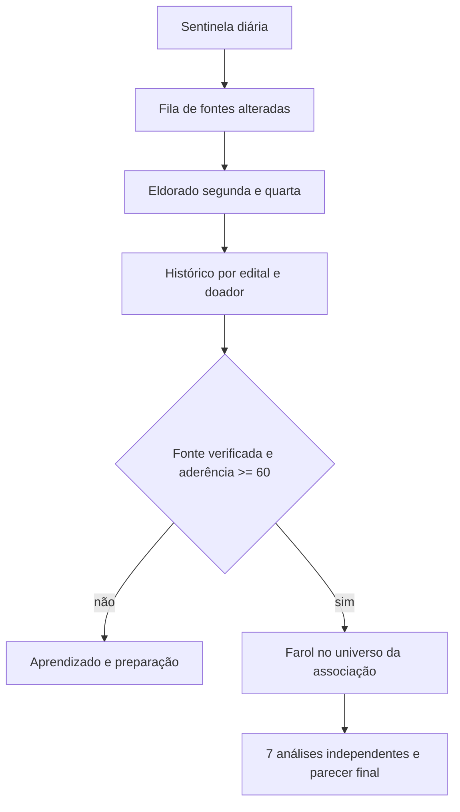

# Arquitetura

## Fluxo diário

## Contrato de dados

Uma oportunidade só atravessa o portão de confirmação quando possui `titulo`, URL primária, `fonte_id`, `coletado_em` e pelo menos um trecho de evidência. A pista social reforça, mas nunca substitui, a fonte primária. Dados desconhecidos permanecem `null`; não são estimados.

O matching tem duas etapas:

1. **Portão eliminatório**: natureza jurídica, território, área, antiguidade, inscrições/certificações e prazo.
2. **Pontuação explicável**: aderência temática, territorial, experiência, documentação, capacidade financeira e histórico com o financiador.

Cada associação recebe uma execução independente. O agregador do painel lê apenas os resultados finais e nunca cruza documentos ou dados brutos entre associações.

Cada caso do Farol nasce dentro de `dados/associacoes/<id>/farol/casos/<oportunidade>`. O sistema não mantém ranking detalhado global e valida que o `id` do perfil seja igual ao nome da pasta.

## Economia de tokens

O pipeline normal usa regras locais. Para uma análise por Claude ou ChatGPT, o dashboard exporta somente o recorte filtrado, com limite configurável. Nenhum perfil de associação entra nessa exportação do Eldorado e o documento integral não é enviado automaticamente.

## Limite honesto de cobertura

“Todo o país” significa cobertura federativa e temática expansível, não a promessa impossível de que toda página da internet será descoberta. `config/portais_federativos.json` mapeia os 27 portais estaduais; uma página específica só entra em `config/fontes.json` depois de validada. O coletor consulta somente fontes ativas, no escopo e em modo público, e rejeita links para domínios não autorizados.
