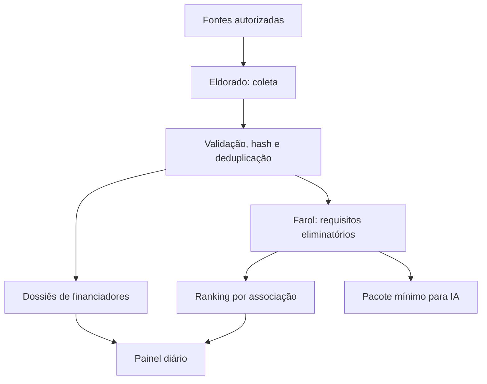

# Arquitetura

## Fluxo diário

## Contrato de dados

Uma oportunidade só atravessa o portão de confirmação quando possui `titulo`, `url`, `fonte_id`, `coletado_em` e pelo menos um trecho de evidência. Dados desconhecidos permanecem `null`; não são estimados.

O matching tem duas etapas:

1. **Portão eliminatório**: natureza jurídica, território, área, antiguidade, inscrições/certificações e prazo.
2. **Pontuação explicável**: aderência temática, territorial, experiência, documentação, capacidade financeira e histórico com o financiador.

Cada associação recebe uma execução independente. O agregador do painel lê apenas os resultados finais e nunca cruza documentos ou dados brutos entre associações.

## Economia de tokens

O pipeline normal usa regras locais. Para uma análise por Claude ou ChatGPT, o dashboard exporta somente: resumo da oportunidade, evidências citadas, requisitos, perfil selecionado e referências legais relevantes. O documento integral não é enviado automaticamente.

## Limite honesto de cobertura

“Todo o país” significa cobertura federativa e temática expansível, não a promessa impossível de que toda página da internet será descoberta. `config/fontes.json` é o registro auditável: somente fontes ativas ali configuradas são monitoradas. O relatório de cobertura mostra fontes saudáveis, falhas e lacunas.

