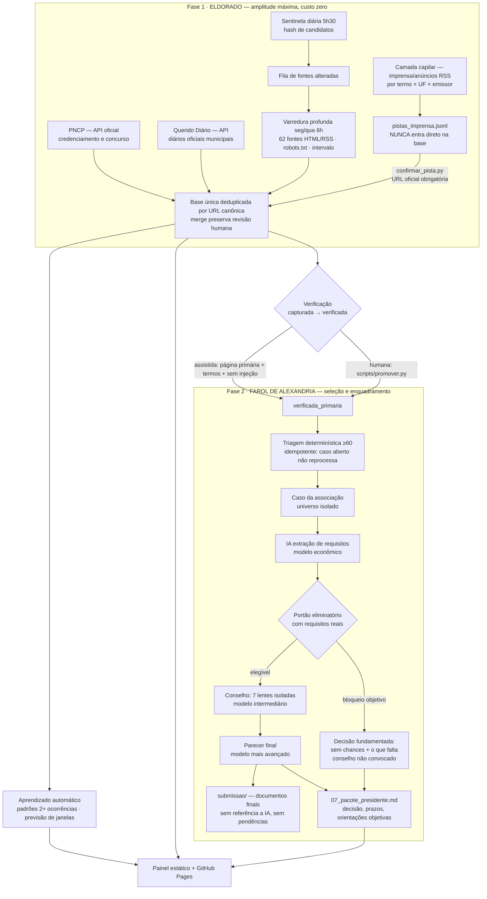
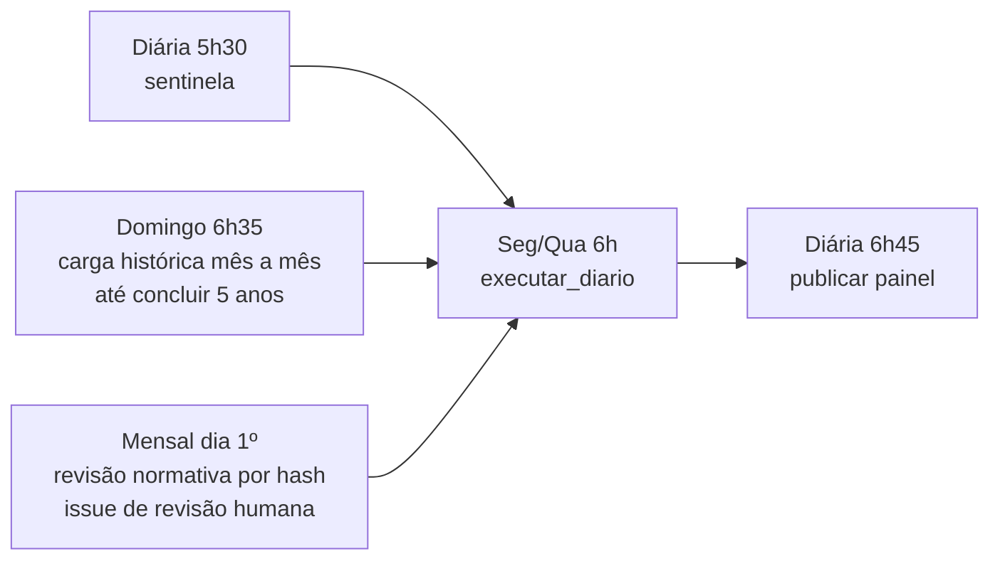

# Arquitetura

## Fluxo completo (visão geral)

## Contrato de dados

Uma oportunidade só atravessa o portão de confirmação quando possui `titulo`, URL primária, `fonte_id`, `coletado_em` e pelo menos um trecho de evidência. Pista social/imprensa reforça, mas nunca substitui, a fonte primária. Dados desconhecidos permanecem `null`; não são estimados.

A base é **deduplicada globalmente pela URL canônica** (`novo_id`): o mesmo edital visto por fontes diferentes é um único registro, com `fontes_observadas` acumulando as origens. A recoleta usa `merge_registro`: **status definidos por humano (ou verificação assistida auditada) nunca regridem** e os campos `requisitos`, `notas`, `verificado_*` são preservados.

O matching tem duas etapas:

1. **Portão eliminatório**: natureza jurídica, território, área, antiguidade, inscrições/certificações e prazo — alimentado pelos `requisitos` extraídos do edital (IA de extração) e validáveis por humano (`requisitos_validados`).
2. **Pontuação explicável**: aderência temática, territorial, experiência, documentação, capacidade financeira e histórico com o financiador.

Cada associação recebe execução independente e diretório exclusivo; o agregador do painel lê apenas resultados finais.

## Ciclo de operação

`executar_diario` roda as etapas em isolamento (falha em uma não derruba as outras) e `resumo_execucao` decide alertas: **>50% de fontes falhando, 3 execuções sem novidade ou etapa quebrada abrem issue** — o sistema não falha em silêncio.

## Economia de tokens e de espaço

- O pipeline de descoberta é 100% biblioteca-padrão: **zero tokens** na coleta, dedupe, triagem, dossiês, aprendizado e painel.
- IA entra **apenas** no Farol (caso aberto) e em três papéis com modelo dimensionado por tarefa (`config/ia.json`): extração (econômico) → conselho (intermediário) → parecer/documentos (mais avançado). Bloqueio eliminatório objetivo **dispensa o conselho**.
- Limites duros por execução: casos com IA, tamanho de edital, tamanho de pacote e tokens de saída são configuráveis; todo uso fica em `estado/ia_uso.jsonl`.
- Espaço: JSONL compacto, dossiês compactos (`eventos.compacto.json`), derivados de documentos em `.gz`, históricos por edital apenas com o diff de campos rastreados.

## Aprendizado com editais anteriores

`src/aprendizado.py` roda a cada execução: requisitos recorrentes viram **padrão só com duas ocorrências validadas** (antes disso, hipótese) e a recorrência mensal de publicação em anos distintos vira **previsão de janela** (`estado/previsoes.json`), sempre rotulada hipótese. É a base para preparar a associação ANTES do edital abrir — documentos e certificações prontos na janela provável.

## Limite honesto de cobertura

“Todo o país” significa: 62 fontes catalogadas (27 portais estaduais na raiz + federais + setoriais + privadas + internacionais), PNCP (todos os entes) e Querido Diário (diários municipais) — cobertura federativa real e expansível, não a promessa impossível de ler toda a internet. Páginas específicas continuam entrando em `config/fontes.json` após validação (`estado/cobertura_catalogo.json` lista a fila dos 260 pontos do acervo ainda descobertos). Portais autenticados (Goodstack, UN Partner Portal) permanecem manuais, sem burlar cadastro.
