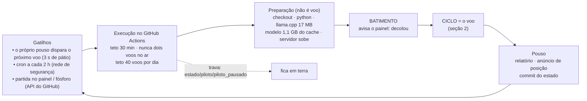
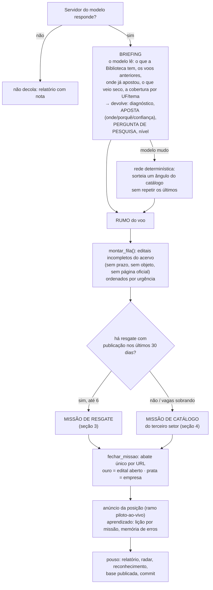
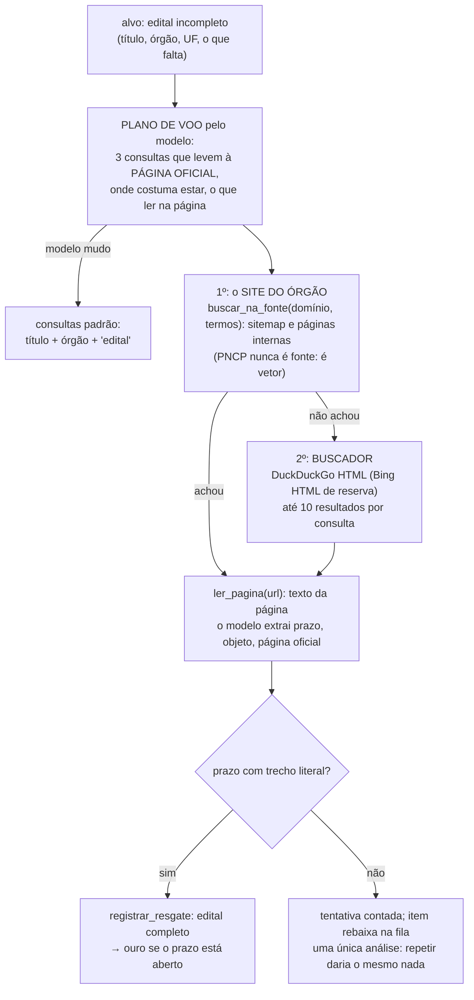
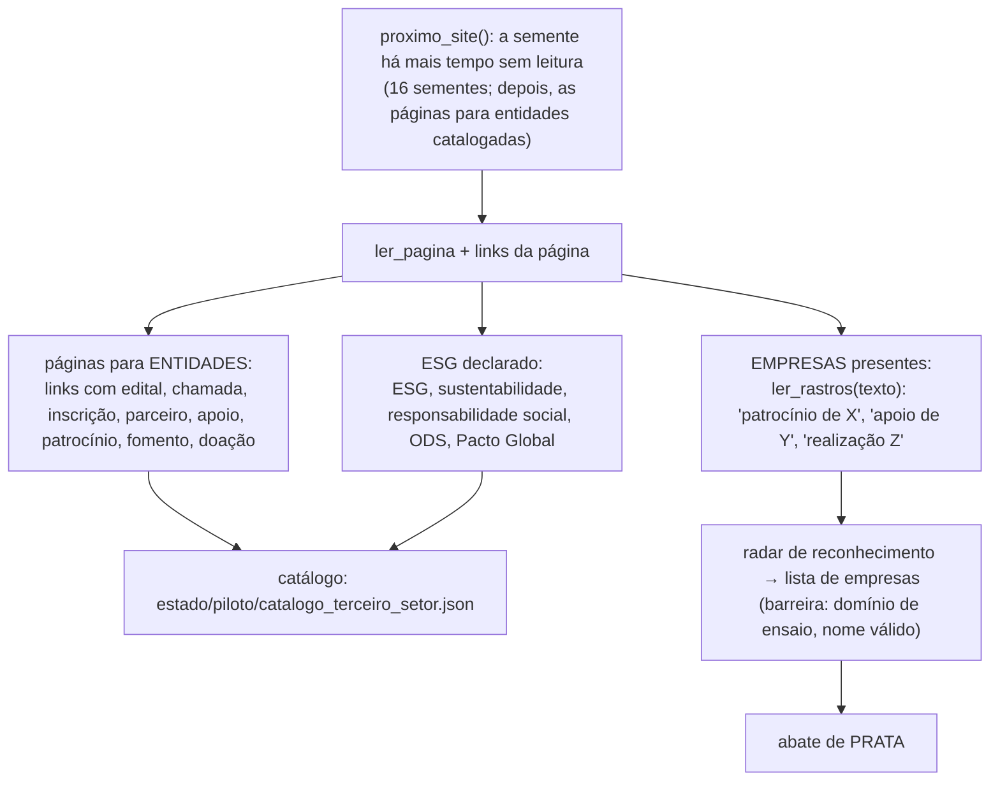

# Diagnóstico e parecer — o trabalho do Piloto · 24/09/2026, 20h

*Tudo aqui vem do código (`src/piloto.py`, `missao_especial.py`, `catalogo_terceiro_setor.py`, `briefing_piloto.py`,
`piloto_busca.py`, `esquadrilha.py`), da configuração (`config/piloto.json`, `cargo_piloto.json`, `agenda_motores.json`) e dos
registros do dia (100 execuções no GitHub, bordo, relatórios, desempenho em voo). Onde o dado não existe, está escrito.*

## 1. O que o Piloto é e como é acionado

O Piloto é um processo que roda no GitHub Actions, com um modelo de linguagem local (Qwen3-1.7B, servido pelo llama.cpp),
para fazer o que os 30 motores de busca não fazem: **ler, decidir e procurar** onde não há edital estruturado.

**Parâmetros de acionamento** (`config/piloto.json`): teto do voo 26 min (para caber nos 30 do job); pátio 3 s; teto diário 40
voos; travas: arquivo de pausa, teto diário, "nunca dois voos no ar" (`concurrency: piloto`, sem cancelar o que está em curso).

## 2. O voo, passo a passo

**Regras que o voo cumpre (24/09):**

| regra | onde está | cumprida hoje? |
|---|---|---|
| resgate antes da exploração | `ciclo()` | sim — mas a fila não tem item com data, então o resgate **nunca entra** |
| resgate só de publicação nos últimos 30 dias | `_recente()` em `ciclo()` | sim (0 de 3 itens têm data de publicação) |
| sem resgate, catálogo do terceiro setor | `proximo_site()` | sim — 8 sites lidos, depois as páginas para entidades |
| site lido só volta em 7 dias | `catalogo_terceiro_setor.REVISITA_DIAS` | sim |
| abate único por URL, com tipo (ouro/prata) | `esquadrilha.fechar_missao` | sim, desde 19h50 (antes não tinha entrado) |
| empresa achada vai para a lista de empresas | `reconhecimento.alimentar_listas_de_empresas` | sim, com barreira de domínio de ensaio |
| domínio de ensaio nunca entra | `config/dominios_de_ensaio.json` | sim |
| qualquer prazo inventado elimina o ocupante | regra do cargo | vigente; não houve prazo inventado |
| ocupante que responde < 50% em 10+ pedidos é candidato a saída | `cargo_piloto.deve_sair` | **disparou**: 16% |
| voo não anuncia nem conta em teste | `ELDORADO_VOO_REAL` | sim |

## 3. A missão de resgate — onde ele pesquisa e como

**Onde ele pesquisa, em ordem:** o domínio do próprio órgão (sitemap e páginas com os termos), depois o DuckDuckGo em HTML,
depois o Bing em HTML. Hoje: DuckDuckGo entregou 78 de 80 buscas; ontem, 1 de 9. Não há chave da Brave configurada.

## 4. A missão de catálogo — a regra nova

Resultado até agora: 8 sites lidos em ~1 h (Observatório do 3º Setor 10 páginas para entidades, IDIS 13, ABCR 4, GIFE 2,
Prosas 2); ESG declarado em 6 de 8; **1 empresa** encontrada — página inicial raramente lista apoiadores.

## 5. O processo criativo dos prompts

Há três prompts, e o "processo criativo" é o do briefing:

1. **Briefing** — o modelo recebe a Biblioteca resumida, os voos anteriores com resultado, os lugares onde já apostou, os que
   vieram secos e a cobertura por UF e tema, com a instrução: *"pense como quem caça a FONTE do dinheiro, não o edital"*. Devolve
   uma **aposta** (onde, porquê, confiança), a **pergunta de pesquisa** do voo, o que procurar e o nível.
2. **Plano de voo do resgate** — dado o edital incompleto, escreve as três consultas que levam à página oficial.
3. **Crivo da caça** — dada uma página, decide se é oportunidade e extrai prazo com trecho literal.

**O que acontece na prática:** o modelo responde a **16% dos pedidos** (38 pedidos, 6 respostas). Em 84% dos voos o briefing
cai na rede determinística — sorteio de ângulo do catálogo — e as consultas do resgate viram "título + órgão + edital". O
processo criativo existe no desenho e quase não existe na execução.

## 6. Tempo: quanto voa, quanto fica parado

| medida (24/09, UTC) | valor |
|---|---|
| execuções | 100 · 69 sucesso · 24 falha · 7 canceladas |
| janela observada | 708 min (11 h 48) |
| tempo com execução no ar | 634 min (**89%**) |
| parado | 74 min, dos quais **um buraco de 210 min** (16h06 → 19h36) quando a corrente quebrou e só o cron das 2 h religou |
| duração mediana de uma execução | **7,0 min** |
| duração do voo em si (ciclo) | 0,5 a 3 min |
| logo: preparação por execução | **4 a 6 min** — checkout, dependências, llama.cpp, modelo do cache, servidor subindo |
| missão de catálogo | mediana **4 s** |
| missão de caça (antiga) | 51 s · descobrir local 6 s · afiar 19 s |

**Leitura:** o Piloto "voa" 89% do tempo, mas **dois terços de cada execução são preparação**, não busca. Um voo de 0,5 min custa
7 min de máquina. É o custo de não ter servidor próprio: cada voo reconstrói o mundo.

## 7. O que não existe, lacunas e falhas

| lacuna | efeito | gravidade |
|---|---|---|
| **Modelo mudo em 84%** dos pedidos | briefing, plano e crivo caem na regra fixa; nenhuma extração de prazo pelo modelo | crítica |
| **Nenhum item da fila de resgate tem data de publicação** (0 de 3) | a regra dos 30 dias nunca ativa o resgate; o voo é só catálogo | crítica |
| Missão de catálogo dura 4 s e acha 1 empresa em 8 sites | lê só a página inicial; apoiadores ficam em "parceiros/apoiadores" | alta |
| Corrente quebra e só volta pelo cron de 2 h (buraco de 210 min hoje) | o pouso deveria religar mesmo após falha; falhou em 24 execuções sem registro em `erro_do_voo.json` | alta |
| 4–6 min de preparação por voo | 2/3 da máquina gastos fora da busca | alta |
| Segunda etapa da verificação (órgão, prazo, valor na página oficial) não grava os três campos | sem órgão não há recorrência; sem prazo não há ouro | alta |
| Não há resposta bruta do modelo guardada | não se sabe se ele responde fora do formato ou não responde | média |
| Sem Brave; DuckDuckGo por HTML | funciona hoje (78/80), bloqueou ontem (1/9) | média |
| Tempo de preparação não medido no relatório | o relatório só mede o ciclo | baixa |

## 8. O conselho

**Extremamente pessimista — chief engineer.** Um motor principal cujo cérebro responde 16% das vezes e cuja missão prioritária
nunca é acionada não é o motor principal: é um catálogo de home pages rodando a cada 7 minutos.

**Pessimista — staff engineer.** Dois terços da máquina vão para preparação. Com voos de 30 segundos, o desenho "cada voo
reconstrói o mundo" custa mais do que entrega.

**Levemente pessimista — professor.** A regra dos 30 dias é boa e está morta na chegada: ninguém grava data de publicação. Regra
sem dado é decoração.

**Neutro — CTO (ponderador).** Parâmetros claros e objetivos para a finalidade principal, nesta ordem:
1. **Data de publicação e órgão gravados na captura**, por todos os motores — é o que liga a regra dos 30 dias e a recorrência.
2. **Resposta bruta do modelo guardada em cada pedido mudo** por 3 dias; depois disso, decidir entre corrigir o formato ou trocar o
   modelo — não antes.
3. **Catálogo com profundidade**: página inicial → páginas de parceiros/apoiadores/editais (já entrou), com extração de
   apoiadores nessas páginas, não na inicial.
4. **Pouso que religa mesmo após falha**, e falha fora do ciclo registrada.
5. **Servidor próprio** (Oracle gratuito em São Paulo): elimina os 4–6 min de preparação, mantém o modelo carregado, dá IP brasileiro.
6. Brave: fazer, é grátis; não é o gargalo.

**Levemente otimista — professor.** A infraestrutura funciona: 89% do tempo no ar, posição ao vivo em toda missão, abates com regra.
O que falta é dado na entrada e um cérebro que responda.

**Otimista — staff engineer.** As páginas para entidades já catalogadas (31 só hoje) são a fila de resgate que a Biblioteca não
tinha — cada uma delas pode virar edital com prazo.

**Extremamente otimista — CTO.** Quando a data de publicação entrar na captura, a regra dos 30 dias transforma o Piloto no que ele
foi desenhado para ser: quem completa o que os motores acham, em vez de quem procura sozinho.
