# Relatório individual dos motores de busca

**Gerado em:** 2026-09-24 10:06 UTC · **30 motores** · números lidos dos arquivos do sistema; onde não há dado, está escrito *sem dado*.

## Como ler

Cada motor percorre o mesmo caminho: **agenda → leitura → léxico → captura → triagem → biblioteca**. O fluxo de cada um mostra os números reais em cada passagem, e o estágio em vermelho é **onde ele para** — é ali que a correção tem de mirar.

## Painel das decisões

| decisão | motores |
|---|---|
| **MANTER** | 10 |
| **AFINAR FILTRO** | 1 |
| **REATIVAR** | 5 |
| **COLETA LOCAL** | 4 |
| **INSUMO** | 2 |
| **OBSERVAR** | 5 |
| **MEDIR** | 3 |

| # | motor | estado | mês (exec/esperado · falhas · achados) | acervo (ativo/total · % eliminado) | para em | decisão |
|---|---|---|---|---|---|---|
| 1 | `do-goias` | FUNCIONANDO | 20/21 · 0 · 2 | 9/9 · 0.0% | chega à biblioteca | **MANTER** |
| 2 | `dou` | FUNCIONANDO | 22/23 · 0 · 4 | 3/3 · 0.0% | chega à biblioteca | **MANTER** |
| 3 | `plat-fundos-estaduais-go` | FUNCIONANDO | 3/3 · 0 · 3 | 0/0 · — | captura sem ficha | **MANTER** |
| 4 | `plat-goias-social` | FUNCIONANDO | 3/3 · 0 · 3 | 6/6 · 0.0% | chega à biblioteca | **MANTER** |
| 5 | `plat-mp-destinacoes-reparacao` | FUNCIONANDO | 3/3 · 0 · 3 | 2/2 · 0.0% | chega à biblioteca | **MANTER** |
| 6 | `plat-ovg` | FUNCIONANDO | 3/3 · 0 · 3 | 0/0 · — | captura sem ficha | **MANTER** |
| 7 | `plat-salic` | FUNCIONANDO | 3/3 · 0 · 3 | 5/5 · 0.0% | chega à biblioteca | **MANTER** |
| 8 | `plat-secult-go` | FUNCIONANDO | 3/3 · 0 · 3 | 7/9 · 22.2% | chega à biblioteca | **MANTER** |
| 9 | `plat-sindico-aberto` | FUNCIONANDO | 2/2 · 0 · 2 | 12/12 · 0.0% | chega à biblioteca | **MANTER** |
| 10 | `recorrencia` | FUNCIONANDO | 2/3 · 0 · 2 | 2/2 · 0.0% | chega à biblioteca | **MANTER** |
| 11 | `pncp-api` | LENDO SEM ACHAR | 23/23 · 8 · 3 | 154/587 · 73.8% | triagem | **AFINAR FILTRO** |
| 12 | `empresas-incentivadas` | FUNCIONANDO | 4/20 · 0 · 1 | 1/1 · 0.0% | agenda | **REATIVAR** |
| 13 | `plat-abcr` | FUNCIONANDO | 6/20 · 1 · 5 | 14/14 · 0.0% | agenda | **REATIVAR** |
| 14 | `plat-gife` | LENDO SEM ACHAR | 6/20 · 0 · 0 | 0/0 · — | agenda | **REATIVAR** |
| 15 | `plat-observatorio-3setor` | FUNCIONANDO | 6/20 · 0 · 6 | 19/20 · 5.0% | agenda | **REATIVAR** |
| 16 | `plat-prosas-premios` | LENDO SEM ACHAR | 6/20 · 0 · 0 | 0/0 · — | agenda | **REATIVAR** |
| 17 | `camara-goiania-pl` | LENDO SEM ACHAR | 20/3 · 0 · 0 | 0/0 · — | leitura | **COLETA LOCAL** |
| 18 | `dj-trf1-go` | LENDO SEM ACHAR | 20/3 · 0 · 0 | 0/0 · — | leitura | **COLETA LOCAL** |
| 19 | `dje-tjgo` | BLOQUEADO | 20/20 · 5 · 0 | 0/0 · — | leitura | **COLETA LOCAL** |
| 20 | `do-goiania` | LENDO SEM ACHAR | 20/21 · 1 · 0 | 0/0 · — | leitura | **COLETA LOCAL** |
| 21 | `alego-pl` | FUNCIONANDO | 20/20 · 0 · 6 | 1/1 · 0.0% | chega à biblioteca | **INSUMO** |
| 22 | `cnj-destinacoes` | LENDO SEM ACHAR | 20/1 · 1 · 0 | 0/0 · — | léxico | **INSUMO** |
| 23 | `plat-cnpq-extensao` | LENDO SEM ACHAR | 3/3 · 0 · 0 | 0/0 · — | léxico | **OBSERVAR** |
| 24 | `plat-empresas-editais-incentivados` | LENDO SEM ACHAR | 3/3 · 0 · 0 | 0/0 · — | léxico | **OBSERVAR** |
| 25 | `plat-fapeg` | LENDO SEM ACHAR | 3/3 · 0 · 0 | 5/5 · 0.0% | léxico | **OBSERVAR** |
| 26 | `plat-prefeituras-50-go` | LENDO SEM ACHAR | 3/3 · 0 · 0 | 0/0 · — | léxico | **OBSERVAR** |
| 27 | `plat-prosas` | LENDO SEM ACHAR | 3/3 · 0 · 0 | 0/0 · — | léxico | **OBSERVAR** |
| 28 | `motor-gife` | sem auditoria | —/— · — · — | 0/0 · — | sem medição | **MEDIR** |
| 29 | `motor-patrocinio` | sem auditoria | —/— · — · — | 0/0 · — | sem medição | **MEDIR** |
| 30 | `sindico-aberto` | sem auditoria | —/— · — · — | 0/0 · — | sem medição | **MEDIR** |

---

## Os motores, um a um

### 1. Diário Oficial do Estado de Goiás  
`do-goias` · decisão: **MANTER** — produz e o que produz sobrevive à triagem

**Parâmetros.** diário oficial estadual — SECULT, SEDS, SES, SEEL e decretos de emenda. Tipo: diario_oficial · finalidade: descoberta · cadência: a cada 1 dia(s) · coleta: **local** (recusa endereço estrangeiro; roda pelo computador do titular, não pelo voo).

**Onde busca.** 4 rota(s) em 3 domínio(s): Diário Oficial do Estado (ABC) (`diariooficial.abc.go.gov.br`); SECULT-GO — Chamamentos Públicos (`goias.gov.br`); SEDS — Goiás Social e cofinanciamento (`goias.gov.br`); OVG — editais e credenciamento de parceiras (`ovg.org.br`).

**Léxico.** Camada 1 (13 termos, abre a leitura): *chamamento público*, *termo de fomento*, *termo de colaboração*, *PNAB*, *Goyazes*, *Fundo de Arte e Cultura*, *Lei Paulo Gustavo*, *FEAS*, *cofinanciamento*, *Goiás Social* … +3. Camada 2 (11 termos, confirma): *Lei 13.019*, *Lei Estadual*, *SECULT*, *SEDS*, *SES-GO*, *SEEL*, *plano de trabalho*, *das inscrições* … +3. Veto geral: 12 termos.

**Bloqueio.** estado **FUNCIONANDO** — leu em 2026-09-22; 44 achado(s) acumulado(s). Domínios com recusa registrada: `diariooficial.abc.go.gov.br` (4), `goias.gov.br` (39), `www.goias.gov.br` (6), `www.ovg.org.br` (8)

**Setembro.** rodou 20 de 21 dias (95%); dias por estado: nao exec 3, sem oport 18, encontrado 2; achados no mês: 2; veredito da validação: *lacunas*.

**Resultado no acervo.** 9 registro(s) na Biblioteca — **9 não eliminado(s)** (ainda não quer dizer aprovado), 0 fora do objeto, 0 fora da abrangência: **0.0% eliminado**. Fontes: `do-goias`. Achados totais na auditoria: 44. **35 achado(s) ficaram entre a captura e a Biblioteca** (duplicata de registro já existente ou descarte antes de virar ficha).

**Onde para: chega à biblioteca.** 9 de 9 ativos.

**Fluxo do motor**

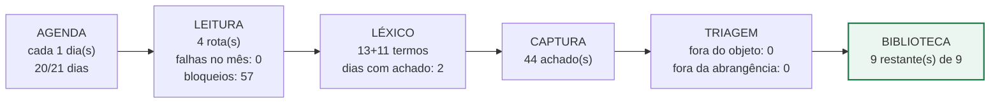


> *Auditoria de 23/09 (ponderadora):* manter e abrir o PDF da edição: o ato está dentro, não no índice.

---

### 2. Diário Oficial da União  
`dou` · decisão: **MANTER** — produz e o que produz sobrevive à triagem

**Parâmetros.** diário federal — MDHC, CONANDA, MinC, MDS, emendas e Rouanet. Tipo: diario_oficial · finalidade: descoberta · cadência: a cada 1 dia(s) · coleta: **nuvem**.

**Onde busca.** 4 rota(s) em 2 domínio(s): DOU Seção 3 (edição do dia, JSON) (`in.gov.br`); MDHC / CONANDA — chamamentos do FNCA (`gov.br`); MinC — editais e Salic (`gov.br`); MDS — editais SUAS (`gov.br`).

**Léxico.** Camada 1 (13 termos, abre a leitura): *chamamento público*, *edital de chamamento*, *seleção pública*, *FNCA*, *CONANDA*, *Fundo Nacional do Idoso*, *Lei Rouanet*, *PRONAS*, *PRONON*, *Lei de Incentivo ao Esporte* … +3. Camada 2 (9 termos, confirma): *Lei 13.019*, *Decreto 8.726*, *organizações da sociedade civil*, *Transferegov*, *plano de trabalho*, *das inscrições*, *do objeto*, *recursos do fundo* … +1. Veto geral: 12 termos.

**Bloqueio.** estado **FUNCIONANDO** — leu em 2026-09-22; 10 achado(s) acumulado(s). Domínios com recusa registrada: `diariooficial.goiania.go.gov.br` (14), `www.in.gov.br` (286), `diariooficial.abc.go.gov.br` (4), `www.goiania.go.gov.br` (33), `www.goias.gov.br` (6), `pncp.gov.br` (43), `www.caixa.gov.br` (1), `transparencia.camaragyn.go.gov.br` (21), `goias.gov.br` (39), `www.gov.br` (107), `mapaosc.ipea.gov.br` (2), `cnetmobile.estaleiro.serpro.gov.br` (4), `www.bndes.gov.br` (2), `rouanet.cultura.gov.br` (2), `www.novohamburgo.rs.gov.br` (2), `sistema.mirassoldoeste.mt.gov.br` (2), `www.arapongas.pr.gov.br` (1)

**Setembro.** rodou 22 de 23 dias (96%); dias por estado: encontrado 4, sem oport 18, nao exec 1; achados no mês: 4; veredito da validação: *lacunas*.

**Resultado no acervo.** 3 registro(s) na Biblioteca — **3 não eliminado(s)** (ainda não quer dizer aprovado), 0 fora do objeto, 0 fora da abrangência: **0.0% eliminado**. Fontes: `dou`. Achados totais na auditoria: 10. **7 achado(s) ficaram entre a captura e a Biblioteca** (duplicata de registro já existente ou descarte antes de virar ficha).

**Onde para: chega à biblioteca.** 3 de 3 ativos.

**Fluxo do motor**

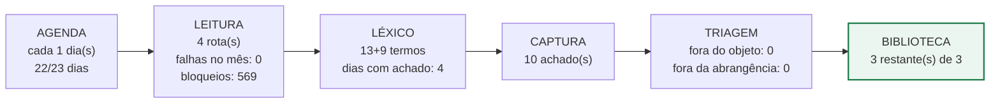


> *Auditoria de 23/09 (ponderadora):* manter; validar por 7 dias se o JSON volta a trazer matérias — se não, ler a seção 3 pela busca avançada.

---

### 3. Fundos estaduais de Goiás com conselho — FIA, Idoso, FUNJUVE, Meio Ambiente  
`plat-fundos-estaduais-go` · decisão: **MANTER** — produz e o que produz sobrevive à triagem

**Parâmetros.** fundos estaduais com conselho — publicam por RESOLUÇÃO, não só por edital. Tipo: plataforma · finalidade: descoberta · cadência: a cada 1 dia(s) · coleta: **nuvem**.

**Onde busca.** 4 rota(s) em 2 domínio(s): CEDCA-GO — FIA estadual (resoluções e editais) (`goias.gov.br`); Conselho Estadual do Idoso — Fundo do Idoso (`goias.gov.br`); SEMAD — FEMA (`goias.gov.br`); Diário Oficial do Estado (resoluções dos conselhos) (`diariooficial.abc.go.gov.br`).

**Léxico.** Camada 1 (19 termos, abre a leitura): *FIA*, *Fundo da Infância*, *Fundo do Idoso*, *FUNJUVE*, *FEMA*, *resolução*, *CEDCA*, *CEI*, *edital*, *chamamento* … +9. Camada 2 (5 termos, confirma): *entidades registradas*, *plano de aplicação*, *das inscrições*, *organizações da sociedade civil*, *conselho estadual*. Veto geral: 12 termos.

**Bloqueio.** estado **FUNCIONANDO** — leu em 2026-09-23; 6 achado(s) acumulado(s). Domínios com recusa registrada: `diariooficial.abc.go.gov.br` (4), `goias.gov.br` (39), `www.goias.gov.br` (6)

**Setembro.** rodou 3 de 3 dias (100%); dias por estado: nao exec 20, encontrado 3; achados no mês: 3; veredito da validação: *lacunas*.

**Resultado no acervo.** nenhuma ficha na Biblioteca atribuída a ele. Achados totais na auditoria: 6. **6 achado(s) ficaram entre a captura e a Biblioteca** (duplicata de registro já existente ou descarte antes de virar ficha).

**Onde para: captura sem ficha.** 6 achado(s) sem ficha na Biblioteca.

**Fluxo do motor**

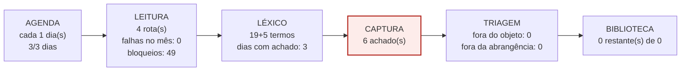


> *Auditoria de 23/09 (ponderadora):* INCLUÍDO hoje; ler também as resoluções dos conselhos.

---

### 4. Goiás Social — programas e editais para entidades  
`plat-goias-social` · decisão: **MANTER** — produz e o que produz sobrevive à triagem

**Parâmetros.** programas sociais do Estado com repasse a entidades (Auxílio Nutricional já validado). Tipo: plataforma · finalidade: descoberta · cadência: a cada 1 dia(s) · coleta: **nuvem**.

**Onde busca.** 2 rota(s) em 1 domínio(s): Goiás Social (`goias.gov.br`); SEDS — editais (`goias.gov.br`).

**Léxico.** Camada 1 (17 termos, abre a leitura): *Auxílio Nutricional*, *cofinanciamento*, *edital*, *chamamento*, *entidades filantrópicas*, *assistência social*, *inscrições*, *CMAS*, *chamamento público*, *termo de fomento* … +7. Camada 2 (5 termos, confirma): *organizações da sociedade civil*, *plano de trabalho*, *das inscrições*, *certificado*, *CEBAS*. Veto geral: 12 termos.

**Bloqueio.** estado **FUNCIONANDO** — leu em 2026-09-23; 6 achado(s) acumulado(s). Domínios com recusa registrada: `goias.gov.br` (39), `www.goias.gov.br` (6)

**Setembro.** rodou 3 de 3 dias (100%); dias por estado: nao exec 20, encontrado 3; achados no mês: 3; veredito da validação: *lacunas*.

**Resultado no acervo.** 6 registro(s) na Biblioteca — **6 não eliminado(s)** (ainda não quer dizer aprovado), 0 fora do objeto, 0 fora da abrangência: **0.0% eliminado**. Fontes: `goias-social`. Achados totais na auditoria: 6.

**Onde para: chega à biblioteca.** 6 de 6 ativos.

**Fluxo do motor**

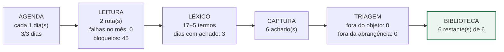


> *Auditoria de 23/09 (ponderadora):* INCLUÍDO hoje.

---

### 5. Ministérios Públicos — editais de destinação de recursos de reparação e bens lesados  
`plat-mp-destinacoes-reparacao` · decisão: **MANTER** — produz e o que produz sobrevive à triagem

**Parâmetros.** Ministérios Públicos — destinação de reparação, TAC, bens lesados e multas a projetos sociais. Tipo: plataforma · finalidade: descoberta · cadência: a cada 1 dia(s) · coleta: **nuvem**.

**Onde busca.** 3 rota(s) em 3 domínio(s): MPGO — editais de destinação (`mpgo.mp.br`); MPF — chamamentos de destinação (Goiás e nacional) (`mpf.mp.br`); MPT-GO — destinação de multas trabalhistas (`prt18.mpt.mp.br`).

**Léxico.** Camada 1 (19 termos, abre a leitura): *edital de destinação*, *destinação de recursos*, *TAC*, *termo de ajustamento*, *reparação*, *bens lesados*, *multa*, *projetos sociais*, *entidades*, *chamamento* … +9. Camada 2 (6 termos, confirma): *organizações da sociedade civil*, *projeto social*, *das inscrições*, *habilitação*, *Goiás*, *Goiânia*. Veto geral: 12 termos.

**Bloqueio.** estado **FUNCIONANDO** — leu em 2026-09-23; 12 achado(s) acumulado(s). Domínios com recusa registrada: `www.mpgo.mp.br` (59), `transparencia.mpf.mp.br` (1)

**Setembro.** rodou 3 de 3 dias (100%); dias por estado: nao exec 20, encontrado 3; achados no mês: 3; veredito da validação: *lacunas*.

**Resultado no acervo.** 2 registro(s) na Biblioteca — **2 não eliminado(s)** (ainda não quer dizer aprovado), 0 fora do objeto, 0 fora da abrangência: **0.0% eliminado**. Fontes: `plat-mp-destinacoes-reparacao`. Achados totais na auditoria: 12. **10 achado(s) ficaram entre a captura e a Biblioteca** (duplicata de registro já existente ou descarte antes de virar ficha).

**Onde para: chega à biblioteca.** 2 de 2 ativos.

**Fluxo do motor**


> *Auditoria de 23/09 (ponderadora):* INCLUÍDO hoje; MPGO primeiro.

---

### 6. OVG — Organização das Voluntárias de Goiás: editais e chamamentos  
`plat-ovg` · decisão: **MANTER** — produz e o que produz sobrevive à triagem

**Parâmetros.** OVG — maior operador de repasses a entidades de Goiás. Tipo: plataforma · finalidade: descoberta · cadência: a cada 1 dia(s) · coleta: **nuvem**.

**Onde busca.** 4 rota(s) em 3 domínio(s): OVG — portal (`ovg.org.br`); OVG — editais e chamamentos (`ovg.org.br`); Goiás Social (programas operados pela OVG) (`goias.gov.br`); Diário Oficial do Estado (`diariooficial.abc.go.gov.br`).

**Léxico.** Camada 1 (16 termos, abre a leitura): *edital*, *chamamento*, *credenciamento de entidades*, *entidades parceiras*, *Mais Social*, *cofinanciamento*, *termo de fomento*, *termo de colaboração*, *inscrições*, *chamamento público* … +6. Camada 2 (6 termos, confirma): *organizações da sociedade civil*, *plano de trabalho*, *assistência social*, *das inscrições*, *documentos exigidos*, *CMAS*. Veto geral: 12 termos.

**Bloqueio.** estado **FUNCIONANDO** — leu em 2026-09-23; 6 achado(s) acumulado(s). Domínios com recusa registrada: `diariooficial.abc.go.gov.br` (4), `goias.gov.br` (39), `www.goias.gov.br` (6), `www.ovg.org.br` (8)

**Setembro.** rodou 3 de 3 dias (100%); dias por estado: nao exec 20, encontrado 3; achados no mês: 3; veredito da validação: *lacunas*.

**Resultado no acervo.** nenhuma ficha na Biblioteca atribuída a ele. Achados totais na auditoria: 6. **6 achado(s) ficaram entre a captura e a Biblioteca** (duplicata de registro já existente ou descarte antes de virar ficha).

**Onde para: captura sem ficha.** 6 achado(s) sem ficha na Biblioteca.

**Fluxo do motor**

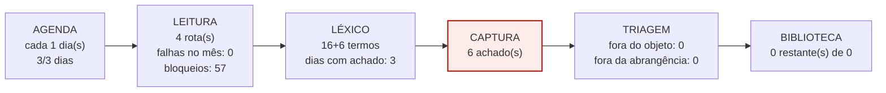


> *Auditoria de 23/09 (ponderadora):* INCLUÍDO hoje; primeira leitura na próxima saída.

---

### 7. SALIC — Lei Rouanet (Ministério da Cultura)  
`plat-salic` · decisão: **MANTER** — produz e o que produz sobrevive à triagem

**Parâmetros.** Lei Rouanet — janela anual no Salic (1º/02 a 31/10, confirmar IN vigente). Tipo: plataforma · finalidade: descoberta · cadência: a cada 1 dia(s) · coleta: **nuvem**.

**Onde busca.** 3 rota(s) em 2 domínio(s): MinC — Lei Rouanet (página institucional) (`gov.br`); Salic — sistema de propostas (`salic.cultura.gov.br`); Instrução Normativa vigente (prazos e limites) (`gov.br`).

**Léxico.** Camada 1 (17 termos, abre a leitura): *Lei Rouanet*, *PRONAC*, *Salic*, *proposta cultural*, *incentivo fiscal*, *mecenato*, *Instrução Normativa*, *prazo de apresentação*, *chamamento público*, *termo de fomento* … +7. Camada 2 (5 termos, confirma): *proponente*, *pessoa jurídica sem fins lucrativos*, *limite por proponente*, *captação*, *aprovação*. Veto geral: 12 termos.

**Bloqueio.** estado **FUNCIONANDO** — leu em 2026-09-23; 30 achado(s) acumulado(s). Domínios com recusa registrada: `diariooficial.goiania.go.gov.br` (14), `www.in.gov.br` (286), `diariooficial.abc.go.gov.br` (4), `www.goiania.go.gov.br` (33), `www.goias.gov.br` (6), `pncp.gov.br` (43), `www.caixa.gov.br` (1), `transparencia.camaragyn.go.gov.br` (21), `goias.gov.br` (39), `www.gov.br` (107), `mapaosc.ipea.gov.br` (2), `cnetmobile.estaleiro.serpro.gov.br` (4), `www.bndes.gov.br` (2), `rouanet.cultura.gov.br` (2), `www.novohamburgo.rs.gov.br` (2), `sistema.mirassoldoeste.mt.gov.br` (2), `www.arapongas.pr.gov.br` (1)

**Setembro.** rodou 3 de 3 dias (100%); dias por estado: nao exec 20, encontrado 3; achados no mês: 3; veredito da validação: *lacunas*.

**Resultado no acervo.** 5 registro(s) na Biblioteca — **5 não eliminado(s)** (ainda não quer dizer aprovado), 0 fora do objeto, 0 fora da abrangência: **0.0% eliminado**. Fontes: `salic`, `plat-salic`. Achados totais na auditoria: 30. **25 achado(s) ficaram entre a captura e a Biblioteca** (duplicata de registro já existente ou descarte antes de virar ficha).

**Onde para: chega à biblioteca.** 5 de 5 ativos.

**Fluxo do motor**

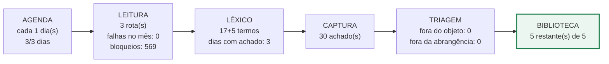


> *Auditoria de 23/09 (ponderadora):* CORRIGIDO hoje; ler a IN vigente para a janela.

---

### 8. Secult Goiás — Goyazes e Aldir Blanc  
`plat-secult-go` · decisão: **MANTER** — produz e o que produz sobrevive à triagem

**Parâmetros.** cinco portas da SECULT-GO — Chamamentos, Goyazes, Fundo de Arte e Cultura, PNAB, Lei Paulo Gustavo. Tipo: plataforma · finalidade: descoberta · cadência: a cada 1 dia(s) · coleta: **nuvem**.

**Onde busca.** 4 rota(s) em 3 domínio(s): Chamamentos Públicos 2026 (`goias.gov.br`); Editais 2026 — PNAB (`goias.gov.br`); Portal PNAB do Estado (`pnab.cultura.go.gov.br`); Diário Oficial do Estado (publicação obrigatória) (`diariooficial.abc.go.gov.br`).

**Léxico.** Camada 1 (17 termos, abre a leitura): *chamamento público*, *edital*, *PNAB*, *Goyazes*, *Fundo de Arte e Cultura*, *Lei Paulo Gustavo*, *inscrições*, *cronograma*, *retificação*, *termo de fomento* … +7. Camada 2 (6 termos, confirma): *Plataforma Baru*, *agentes culturais*, *organizações da sociedade civil*, *das inscrições*, *resultado*, *habilitação*. Veto geral: 12 termos.

**Bloqueio.** estado **FUNCIONANDO** — leu em 2026-09-23; 77 achado(s) acumulado(s). Domínios com recusa registrada: `diariooficial.abc.go.gov.br` (4), `goias.gov.br` (39), `www.goias.gov.br` (6)

**Setembro.** rodou 3 de 3 dias (100%); dias por estado: nao exec 20, encontrado 3; achados no mês: 3; veredito da validação: *lacunas*.

**Resultado no acervo.** 9 registro(s) na Biblioteca — **7 não eliminado(s)** (ainda não quer dizer aprovado), 2 fora do objeto, 0 fora da abrangência: **22.2% eliminado**. Fontes: `plat-secult-go`, `secult-go`. Achados totais na auditoria: 77. **68 achado(s) ficaram entre a captura e a Biblioteca** (duplicata de registro já existente ou descarte antes de virar ficha).

**Onde para: chega à biblioteca.** 7 de 9 ativos.

**Fluxo do motor**


> *Auditoria de 23/09 (ponderadora):* CORRIGIDO hoje; as 5 rotas (Chamamentos, Goyazes, Fundo, PNAB, LPG) já estão na curadoria.

---

### 9. Motor do Piloto — busca aberta no terceiro setor  
`plat-sindico-aberto` · decisão: **MANTER** — produz e o que produz sobrevive à triagem

**Parâmetros.** Procura o que os outros 28 motores NÃO alcançam: empresas, fundações, institutos, plataformas e programas que ninguém catalogou ainda. Não tem rota fixa — tem léxico, territórios e um rodízio de ângulos de ataque. Toda descoberta precisa apontar, no mínimo, o SITE OFICIAL da oportunidade.. Tipo: plataforma · finalidade: — · cadência: a cada 1 dia(s) · coleta: **nuvem**.

**Onde busca.** 3 rota(s) em 1 domínio(s): busca aberta por ângulo sorteado (sem rota fixa) (`html.duckduckgo.com`); site oficial do financiador descoberto (derivado) (``); plataformas ainda não catalogadas (`html.duckduckgo.com`).

**Léxico.** Camada 1 (33 termos, abre a leitura): *edital*, *chamada pública*, *chamamento*, *seleção de projetos*, *seleção pública*, *inscrições abertas*, *apoio a projetos*, *apoio institucional*, *fomento*, *financiamento de projetos* … +23. Camada 2 (14 termos, confirma): *quem pode participar*, *podem se inscrever*, *proponente*, *critérios de seleção*, *cronograma*, *valor do apoio*, *recursos disponíveis*, *regulamento* … +6. Veto geral: 12 termos.

**Bloqueio.** estado **FUNCIONANDO** — leu em 2026-09-23; 54 achado(s) acumulado(s). Nenhum domínio dele na lista de bloqueios.

**Setembro.** rodou 2 de 2 dias (100%); dias por estado: nao exec 21, encontrado 2; achados no mês: 2; veredito da validação: *lacunas*.

**Resultado no acervo.** 12 registro(s) na Biblioteca — **12 não eliminado(s)** (ainda não quer dizer aprovado), 0 fora do objeto, 0 fora da abrangência: **0.0% eliminado**. Fontes: `plat-sindico-aberto`. Achados totais na auditoria: 54. **42 achado(s) ficaram entre a captura e a Biblioteca** (duplicata de registro já existente ou descarte antes de virar ficha).

**Onde para: chega à biblioteca.** 12 de 12 ativos.

**Fluxo do motor**

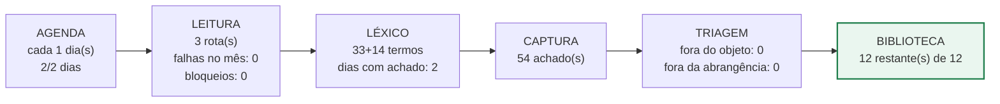


> *Auditoria de 23/09 (ponderadora):* sem parecer registrado — avaliar na próxima auditoria

---

### 10. Motor de Recorrência — revisita as oportunidades identificadas  
`recorrencia` · decisão: **MANTER** — produz e o que produz sobrevive à triagem

**Parâmetros.** RECORRÊNCIA — revisita a página oficial de cada oportunidade validada (retificação, prorrogação, resultado, reabertura); as rotas são dinâmicas e vêm de estado/rotas_recorrencia.json. Tipo: recorrencia · finalidade: recorrencia · cadência: a cada por estado da oportunidade dia(s) · coleta: **nuvem**.

**Onde busca.** 2 rota(s) em 1 domínio(s): Página oficial de cada oportunidade validada (dinâmica) (``); Vetor que anunciou a oportunidade (para pegar prorrogação noticiada) (`observatorio3setor.org.br`).

**Léxico.** Camada 1 (21 termos, abre a leitura): *retificação*, *prorrogação*, *errata*, *resultado*, *homologação*, *classificados*, *recurso*, *suspensão*, *revogação*, *novo edital* … +11. Camada 2 (7 termos, confirma): *prazo prorrogado*, *nova data*, *fica retificado*, *resultado final*, *lista de habilitados*, *edital revogado*, *reabertura*. Veto geral: 12 termos.

**Bloqueio.** estado **FUNCIONANDO** — leu em 2026-09-22; 24 achado(s) acumulado(s). Nenhum domínio dele na lista de bloqueios.

**Setembro.** rodou 2 de 3 dias (67%); dias por estado: nao exec 21, encontrado 2; achados no mês: 2; veredito da validação: *lacunas*.

**Resultado no acervo.** 2 registro(s) na Biblioteca — **2 não eliminado(s)** (ainda não quer dizer aprovado), 0 fora do objeto, 0 fora da abrangência: **0.0% eliminado**. Fontes: `recorrencia`. Achados totais na auditoria: 24. **22 achado(s) ficaram entre a captura e a Biblioteca** (duplicata de registro já existente ou descarte antes de virar ficha).

**Onde para: chega à biblioteca.** 2 de 2 ativos.

**Fluxo do motor**

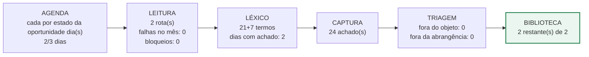


> *Auditoria de 23/09 (ponderadora):* sem parecer registrado — avaliar na próxima auditoria

---

### 11. PNCP — API de contratações (chamamentos e credenciamentos)  
`pncp-api` · decisão: **AFINAR FILTRO** — traz volume, mas quase tudo é ruído

**Parâmetros.** vetor de DESCOBERTA — dá número do processo e órgão; nunca é fonte (311 de 317 registros citam a 14.133). Tipo: api · finalidade: descoberta · cadência: a cada 1 dia(s) · coleta: **nuvem**.

**Onde busca.** 2 rota(s) em 1 domínio(s): API do PNCP — modalidade chamamento e credenciamento (`pncp.gov.br`); Arquivo do edital do órgão hospedado no PNCP (/arquivos/) — documento oficial (`pncp.gov.br`).

**Léxico.** Camada 1 (7 termos, abre a leitura): *chamamento público*, *termo de fomento*, *termo de colaboração*, *organização da sociedade civil*, *Lei 13.019*, *seleção de OSC*, *fomento*. Camada 2 (5 termos, confirma): *Lei 13.019/2014*, *termo de fomento*, *termo de colaboração*, *sem fins lucrativos*, *plano de trabalho*. Veto geral: 12 termos.

**Bloqueio.** estado **LENDO SEM ACHAR** — leu em 2026-09-23; nunca reconheceu edital. Domínios com recusa registrada: `pncp.gov.br` (43)

**Setembro.** rodou 23 de 23 dias (100%); dias por estado: encontrado 3, sem oport 12, falha 8; achados no mês: 3; veredito da validação: *íntegro*.

**Resultado no acervo.** 587 registro(s) na Biblioteca — **154 não eliminado(s)** (ainda não quer dizer aprovado), 246 fora do objeto, 187 fora da abrangência: **73.8% eliminado**. Fontes: `pncp`. Achados totais na auditoria: 0.

**Onde para: triagem.** 433 de 587 registros eliminados (74%).

**Fluxo do motor**

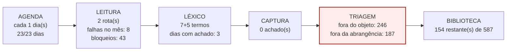


> *Auditoria de 23/09 (ponderadora):* manter como DESCOBERTA (número do processo + órgão), nunca como fonte; o filtro de objeto já barra o ruído.

---

### 12. Editais incentivados — sites das maiores contribuintes do ICMS de Goiás (destinação tributária)  
`empresas-incentivadas` · decisão: **REATIVAR** — não está rodando nos dias previstos

**Parâmetros.** site das maiores empresas contribuintes de Goiás — procura a página de responsabilidade social. Tipo: empresas_incentivo · finalidade: descoberta · cadência: a cada 1 dia(s) · coleta: **nuvem**.

**Onde busca.** 2 rota(s) em 1 domínio(s): Site institucional da empresa (ranking dos 100 maiores contribuintes ICMS-GO) (``); Portais do terceiro setor onde a empresa anuncia (Observatório, ABCR, GIFE) (`observatorio3setor.org.br`).

**Léxico.** Camada 1 (13 termos, abre a leitura): *edital*, *seleção de projetos*, *investimento social*, *responsabilidade social*, *patrocínio*, *incentivo fiscal*, *Lei Rouanet*, *FIA*, *Fundo do Idoso*, *Lei do Esporte* … +3. Camada 2 (8 termos, confirma): *inscrições*, *organizações sem fins lucrativos*, *critérios de seleção*, *valor do apoio*, *cronograma*, *Goiás*, *Goiânia*, *região Centro-Oeste*. Veto geral: 12 termos.

**Bloqueio.** estado **FUNCIONANDO** — leu em 2026-09-18; 1 achado(s) acumulado(s). Nenhum domínio dele na lista de bloqueios. Alerta aberto: 5 dia(s) sem leitura (cadência 1).

**Setembro.** rodou 4 de 20 dias (20%); dias por estado: nao exec 19, encontrado 1, sem oport 3; achados no mês: 1; veredito da validação: *lacunas*.

**Resultado no acervo.** 1 registro(s) na Biblioteca — **1 não eliminado(s)** (ainda não quer dizer aprovado), 0 fora do objeto, 0 fora da abrangência: **0.0% eliminado**. Fontes: `empresas-incentivadas`. Achados totais na auditoria: 1.

**Onde para: agenda.** rodou 4 de 20 dias esperados.

**Fluxo do motor**

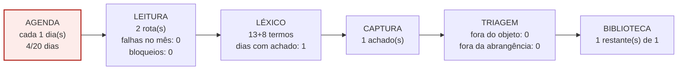


> *Auditoria de 23/09 (ponderadora):* manter e SOMAR o motor novo 'empresas-editais-incentivados', que procura o edital e não o site.

---

### 13. ABCR — Associação Brasileira de Captadores  
`plat-abcr` · decisão: **REATIVAR** — não está rodando nos dias previstos

**Parâmetros.** vetor de DESCOBERTA nacional (Captadores/ABCR). Tipo: plataforma · finalidade: descoberta · cadência: a cada 1 dia(s) · coleta: **nuvem**.

**Onde busca.** 2 rota(s) em 1 domínio(s): ABCR — editais (`captadores.org.br`); Site oficial do financiador anunciado (``).

**Léxico.** Camada 1 (8 termos, abre a leitura): *edital*, *chamada*, *seleção*, *inscrições*, *até R$*, *OSCs*, *organizações sociais*, *prazo*. Camada 2 (5 termos, confirma): *inscrições até*, *podem participar*, *valor*, *regulamento*, *site oficial*. Veto geral: 12 termos.

**Bloqueio.** estado **FUNCIONANDO** — leu em 2026-09-23; 65 achado(s) acumulado(s). Domínios com recusa registrada: `captadores.org.br` (2)

**Setembro.** rodou 6 de 20 dias (30%); dias por estado: nao exec 17, falha 1, encontrado 5; achados no mês: 5; veredito da validação: *lacunas*.

**Resultado no acervo.** 14 registro(s) na Biblioteca — **14 não eliminado(s)** (ainda não quer dizer aprovado), 0 fora do objeto, 0 fora da abrangência: **0.0% eliminado**. Fontes: `abcr`, `plat-abcr`. Achados totais na auditoria: 65. **51 achado(s) ficaram entre a captura e a Biblioteca** (duplicata de registro já existente ou descarte antes de virar ficha).

**Onde para: agenda.** rodou 6 de 20 dias esperados.

**Fluxo do motor**

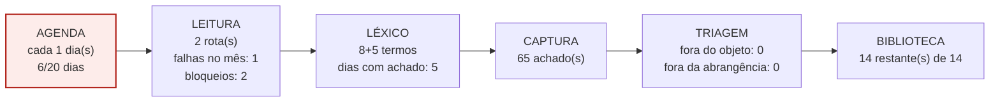


> *Auditoria de 23/09 (ponderadora):* manter como descoberta; nunca como fonte.

---

### 14. GIFE — Grupo de Institutos, Fundações e Empresas  
`plat-gife` · decisão: **REATIVAR** — não está rodando nos dias previstos

**Parâmetros.** associados do GIFE são os maiores investidores sociais privados — a home não lista editais (TROCAR a rota). Tipo: plataforma · finalidade: descoberta · cadência: a cada 1 dia(s) · coleta: **nuvem**.

**Onde busca.** 2 rota(s) em 1 domínio(s): GIFE — agenda e oportunidades dos associados (`gife.org.br`); Sites dos associados (institutos e fundações empresariais) (`gife.org.br`).

**Léxico.** Camada 1 (15 termos, abre a leitura): *edital*, *chamada*, *seleção de projetos*, *inscrições*, *instituto*, *fundação*, *investimento social*, *chamamento público*, *termo de fomento*, *termo de colaboração* … +5. Camada 2 (4 termos, confirma): *organizações da sociedade civil*, *valor*, *prazo*, *regulamento*. Veto geral: 12 termos.

**Bloqueio.** estado **LENDO SEM ACHAR** — leu em 2026-09-23; nunca reconheceu edital. Domínios com recusa registrada: `gife.org.br` (13)

**Setembro.** rodou 6 de 20 dias (30%); dias por estado: nao exec 17, sem oport 6; achados no mês: 0; veredito da validação: *lacunas*.

**Resultado no acervo.** nenhuma ficha na Biblioteca atribuída a ele. Achados totais na auditoria: 0.

**Onde para: agenda.** rodou 6 de 20 dias esperados.

**Fluxo do motor**

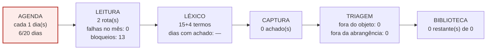


> *Auditoria de 23/09 (ponderadora):* TROCAR a URL para a agenda/oportunidades dos associados; a home não serve.

---

### 15. Observatório do Terceiro Setor — editais  
`plat-observatorio-3setor` · decisão: **REATIVAR** — não está rodando nos dias previstos

**Parâmetros.** vetor de DESCOBERTA nacional — anuncia, não publica; a fonte oficial é localizada depois. Tipo: plataforma · finalidade: descoberta · cadência: a cada 1 dia(s) · coleta: **nuvem**.

**Onde busca.** 2 rota(s) em 1 domínio(s): Observatório — editais (`observatorio3setor.org.br`); Site oficial do financiador anunciado (localizado a partir da matéria) (``).

**Léxico.** Camada 1 (8 termos, abre a leitura): *abre edital*, *abre inscrições*, *seleção de projetos*, *chamada*, *até R$*, *para organizações*, *para OSCs*, *prazo*. Camada 2 (6 termos, confirma): *inscrições até*, *podem participar*, *organizações da sociedade civil*, *valor*, *regulamento*, *site oficial*. Veto geral: 12 termos.

**Bloqueio.** estado **FUNCIONANDO** — leu em 2026-09-23; 65 achado(s) acumulado(s). Nenhum domínio dele na lista de bloqueios.

**Setembro.** rodou 6 de 20 dias (30%); dias por estado: nao exec 17, encontrado 6; achados no mês: 6; veredito da validação: *lacunas*.

**Resultado no acervo.** 20 registro(s) na Biblioteca — **19 não eliminado(s)** (ainda não quer dizer aprovado), 1 fora do objeto, 0 fora da abrangência: **5.0% eliminado**. Fontes: `observatorio-3setor`, `plat-observatorio-3setor`. Achados totais na auditoria: 65. **45 achado(s) ficaram entre a captura e a Biblioteca** (duplicata de registro já existente ou descarte antes de virar ficha).

**Onde para: agenda.** rodou 6 de 20 dias esperados.

**Fluxo do motor**

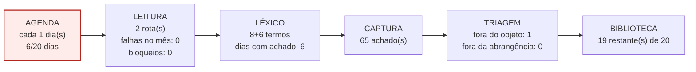


> *Auditoria de 23/09 (ponderadora):* manter como DESCOBERTA; a fonte oficial é sempre localizada depois.

---

### 16. Prosas — prêmios, concursos e cursos para OSCs  
`plat-prosas-premios` · decisão: **REATIVAR** — não está rodando nos dias previstos

**Parâmetros.** prêmios e concursos — muitos a pessoa física; o filtro de objeto barra. Tipo: plataforma · finalidade: descoberta · cadência: a cada 1 dia(s) · coleta: **nuvem**.

**Onde busca.** 2 rota(s) em 1 domínio(s): Prosas — prêmios (`prosas.com.br`); Site oficial do organizador do prêmio (``).

**Léxico.** Camada 1 (14 termos, abre a leitura): *prêmio*, *concurso*, *reconhecimento*, *organizações*, *iniciativas sociais*, *inscrições*, *chamamento público*, *termo de fomento*, *termo de colaboração*, *seleção de projetos* … +4. Camada 2 (4 termos, confirma): *podem concorrer*, *organizações da sociedade civil*, *premiação em dinheiro*, *regulamento*. Veto geral: 12 termos.

**Bloqueio.** estado **LENDO SEM ACHAR** — leu em 2026-09-23; nunca reconheceu edital. Nenhum domínio dele na lista de bloqueios.

**Setembro.** rodou 6 de 20 dias (30%); dias por estado: nao exec 17, sem oport 6; achados no mês: 0; veredito da validação: *lacunas*.

**Resultado no acervo.** nenhuma ficha na Biblioteca atribuída a ele. Achados totais na auditoria: 0.

**Onde para: agenda.** rodou 6 de 20 dias esperados.

**Fluxo do motor**


> *Auditoria de 23/09 (ponderadora):* manter com o filtro de objeto ativo.

---

### 17. Câmara Municipal de Goiânia — projetos de lei  
`camara-goiania-pl` · decisão: **COLETA LOCAL** — a fonte recusa endereço de fora do país; o que a nuvem lê é a página de recusa — só rende pelo computador do titular

**Parâmetros.** insumo de HABILITAÇÃO — declarações de utilidade pública municipal (requisito de editais), não fonte de captação. Tipo: legislativo · finalidade: insumo · cadência: a cada 7 dia(s) · coleta: **local** (recusa endereço estrangeiro; roda pelo computador do titular, não pelo voo).

**Onde busca.** 2 rota(s) em 1 domínio(s): Projetos de lei da Câmara de Goiânia (`goiania.go.leg.br`); Diário da Câmara (`goiania.go.leg.br`).

**Léxico.** Camada 1 (5 termos, abre a leitura): *utilidade pública*, *declara de utilidade pública*, *associação de moradores*, *entidade*, *denominação*. Camada 2 (4 termos, confirma): *Jardim América*, *A.M.C.*, *associação*, *sem fins lucrativos*. Veto geral: 12 termos.

**Bloqueio.** estado **LENDO SEM ACHAR** — leu em 2026-09-23; nunca reconheceu edital. Domínios com recusa registrada: `www.goiania.go.leg.br` (49), `sapl.goiania.go.leg.br` (64)

**Setembro.** rodou 20 de 3 dias (667%); dias por estado: nao exec 3, sem oport 20; achados no mês: 0; veredito da validação: *íntegro*.

**Resultado no acervo.** nenhuma ficha na Biblioteca atribuída a ele. Achados totais na auditoria: 0.

**Onde para: leitura.** a nuvem é recusada; a coleta desta fonte é local.

**Fluxo do motor**

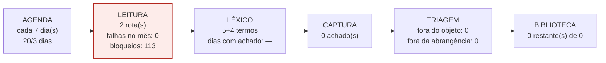


> *Auditoria de 23/09 (ponderadora):* manter em cadência semanal, não diária: é insumo de habilitação, não de captação.

---

### 18. Diário da Justiça Federal — Seção Judiciária de Goiás  
`dj-trf1-go` · decisão: **COLETA LOCAL** — a fonte recusa endereço de fora do país; o que a nuvem lê é a página de recusa — só rende pelo computador do titular

**Parâmetros.** destinações de pena federais — raras em Goiás. Tipo: diario_justica · finalidade: descoberta · cadência: a cada 1 dia(s) · coleta: **local** (recusa endereço estrangeiro; roda pelo computador do titular, não pelo voo).

**Onde busca.** 2 rota(s) em 1 domínio(s): Diário da Justiça Federal — Seção Judiciária de Goiás (`trf1.jus.br`); Editais de destinação de prestações pecuniárias — TRF1 (`trf1.jus.br`).

**Léxico.** Camada 1 (6 termos, abre a leitura): *prestação pecuniária*, *destinação de recursos*, *edital de cadastramento*, *entidades beneficiárias*, *transação penal*, *pena pecuniária*. Camada 2 (5 termos, confirma): *Resolução CNJ 154*, *entidade pública ou privada com destinação social*, *projetos sociais*, *Goiás*, *Goiânia*. Veto geral: 12 termos.

**Bloqueio.** estado **LENDO SEM ACHAR** — leu em 2026-09-23; nunca reconheceu edital. Nenhum domínio dele na lista de bloqueios.

**Setembro.** rodou 20 de 3 dias (667%); dias por estado: nao exec 3, sem oport 20; achados no mês: 0; veredito da validação: *íntegro*.

**Resultado no acervo.** nenhuma ficha na Biblioteca atribuída a ele. Achados totais na auditoria: 0.

**Onde para: leitura.** a nuvem é recusada; a coleta desta fonte é local.

**Fluxo do motor**


> *Auditoria de 23/09 (ponderadora):* reduzir para cadência semanal.

---

### 19. TJGO — varas de execução penal e prestações pecuniárias (substitui o Diário da Justiça)  
`dje-tjgo` · decisão: **COLETA LOCAL** — a fonte recusa endereço de fora do país; o que a nuvem lê é a página de recusa — só rende pelo computador do titular

**Parâmetros.** varas de execução penal de Goiânia — prestações pecuniárias destinadas a entidades, sem edital e sem disputa. Tipo: diario_justica · finalidade: descoberta · cadência: a cada 1 dia(s) · coleta: **local** (recusa endereço estrangeiro; roda pelo computador do titular, não pelo voo).

**Onde busca.** 3 rota(s) em 2 domínio(s): TJGO — editais das varas de execução penal (recusa IP estrangeiro) (`tjgo.jus.br`); Diário da Justiça Eletrônico do TJGO (`tjgo.jus.br`); Portal Corregedoria — cadastramento de entidades (Res. CNJ 154) (`corregedoria.tjgo.jus.br`).

**Léxico.** Camada 1 (7 termos, abre a leitura): *prestação pecuniária*, *edital de cadastramento*, *entidades*, *vara de execução penal*, *VEP*, *destinação*, *Resolução 154*. Camada 2 (5 termos, confirma): *entidade com destinação social*, *projeto social*, *Goiânia*, *prestação de contas*, *habilitação de entidades*. Veto geral: 12 termos.

**Bloqueio.** estado **BLOQUEADO** — todas as páginas falharam em 2026-09-23. Domínios com recusa registrada: `www.tjgo.jus.br` (140), `projudi.tjgo.jus.br` (1) Alerta aberto: todas as páginas falharam em 2026-09-23.

**Setembro.** rodou 20 de 20 dias (100%); dias por estado: nao exec 3, falha 5, sem oport 15; achados no mês: 0; veredito da validação: *lacunas*.

**Resultado no acervo.** nenhuma ficha na Biblioteca atribuída a ele. Achados totais na auditoria: 0.

**Onde para: leitura.** a nuvem é recusada; a coleta desta fonte é local.

**Fluxo do motor**


> *Auditoria de 23/09 (ponderadora):* manter; só a coleta local desbloqueia — junto com o DO-Goiânia é a prioridade 1.

---

### 20. Diário Oficial do Município de Goiânia  
`do-goiania` · decisão: **COLETA LOCAL** — a fonte recusa endereço de fora do país; o que a nuvem lê é a página de recusa — só rende pelo computador do titular

**Parâmetros.** diário oficial municipal — a fonte primária de Goiânia. Tipo: diario_oficial · finalidade: descoberta · cadência: a cada 1 dia(s) · coleta: **local** (recusa endereço estrangeiro; roda pelo computador do titular, não pelo voo).

**Onde busca.** 4 rota(s) em 1 domínio(s): Diário Oficial do Município (edição do dia) (`goiania.go.gov.br`); SEMASDH — Fundo Municipal de Assistência Social e chamamentos (`goiania.go.gov.br`); Secretaria Municipal de Cultura — editais (`goiania.go.gov.br`); CMDCA / CMAS / CMI de Goiânia — resoluções e editais dos fundos (`goiania.go.gov.br`).

**Léxico.** Camada 1 (14 termos, abre a leitura): *chamamento público*, *termo de fomento*, *termo de colaboração*, *FMAS*, *FMDCA*, *fundo municipal*, *CMDCA*, *CMAS*, *CMI*, *utilidade pública* … +4. Camada 2 (12 termos, confirma): *Lei 13.019*, *MROSC*, *Lei Municipal*, *plano de trabalho*, *das inscrições*, *do objeto*, *cronograma*, *recursos do fundo* … +4. Veto geral: 12 termos.

**Bloqueio.** estado **LENDO SEM ACHAR** — leu em 2026-09-22; nunca reconheceu edital. Domínios com recusa registrada: `diariooficial.goiania.go.gov.br` (14), `www.goiania.go.gov.br` (33) Alerta aberto: aguardando coleta local (portal recusa IP estrangeiro).

**Setembro.** rodou 20 de 21 dias (95%); dias por estado: nao exec 3, sem oport 19, falha 1; achados no mês: 0; veredito da validação: *lacunas*.

**Resultado no acervo.** nenhuma ficha na Biblioteca atribuída a ele. Achados totais na auditoria: 0.

**Onde para: leitura.** a nuvem é recusada; a coleta desta fonte é local.

**Fluxo do motor**

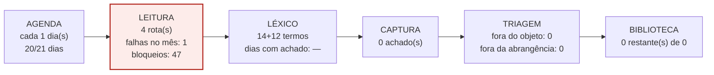


> *Auditoria de 23/09 (ponderadora):* manter; a coleta local (.bat) é o único desbloqueio real — prioridade 1 do titular.

---

### 21. Assembleia Legislativa de Goiás — proposições  
`alego-pl` · decisão: **INSUMO** — não busca oportunidade: alimenta o sistema com emenda parlamentar; não se mede por achado

**Parâmetros.** insumo de EMENDA — proposições e emendas impositivas estaduais (janela out-nov); achados são projetos de lei, não editais. Tipo: legislativo · finalidade: insumo · cadência: a cada 7 dia(s) · coleta: **nuvem**.

**Onde busca.** 2 rota(s) em 2 domínio(s): Proposições da ALEGO (`portal.al.go.leg.br`); LOA e emendas impositivas — SEFAZ/SEGPLAN (`economia.go.gov.br`).

**Léxico.** Camada 1 (8 termos, abre a leitura): *emenda*, *emenda impositiva*, *emenda parlamentar*, *utilidade pública*, *LOA*, *orçamento*, *transferência especial*, *indicação*. Camada 2 (6 termos, confirma): *entidade beneficiária*, *Goiânia*, *assistência social*, *cultura*, *valor da emenda*, *programação orçamentária*. Veto geral: 12 termos.

**Bloqueio.** estado **FUNCIONANDO** — leu em 2026-09-23; 17 achado(s) acumulado(s). Domínios com recusa registrada: `portal.al.go.leg.br` (51)

**Setembro.** rodou 20 de 20 dias (100%); dias por estado: nao exec 3, sem oport 14, encontrado 6; achados no mês: 6; veredito da validação: *lacunas*.

**Resultado no acervo.** 1 registro(s) na Biblioteca — **1 não eliminado(s)** (ainda não quer dizer aprovado), 0 fora do objeto, 0 fora da abrangência: **0.0% eliminado**. Fontes: `alego-pl`. Achados totais na auditoria: 17. **16 achado(s) ficaram entre a captura e a Biblioteca** (duplicata de registro já existente ou descarte antes de virar ficha).

**Onde para: chega à biblioteca.** 1 de 1 ativos.

**Fluxo do motor**

```mermaid
flowchart LR
  A["AGENDA<br/>cada 7 dia(s)<br/>20/20 dias"]
  L["LEITURA<br/>2 rota(s)<br/>falhas no mês: 0<br/>bloqueios: 51"]
  X["LÉXICO<br/>8+6 termos<br/>dias com achado: 6"]
  C["CAPTURA<br/>17 achado(s)"]
  T["TRIAGEM<br/>fora do objeto: 0<br/>fora da abrangência: 0"]
  B["BIBLIOTECA<br/>1 restante(s) de 1"]
  A --> L --> X --> C --> T --> B
  style B fill:#EAF6EF,stroke:#1E7E4B,stroke-width:2px
```


> *Auditoria de 23/09 (ponderadora):* manter; reclassificar os achados como 'insumo de emenda', não como oportunidade.

---

### 22. CNJ — destinações de penas e prestações pecuniárias  
`cnj-destinacoes` · decisão: **INSUMO** — não busca oportunidade: alimenta o sistema com referência normativa; não se mede por achado

**Parâmetros.** REFERÊNCIA, não motor — a fonte real de destinações são os tribunais estaduais (decisão da auditoria de 20/09). Tipo: diario_justica · finalidade: insumo · cadência: a cada 7 dia(s) · coleta: **nuvem**.

**Onde busca.** 2 rota(s) em 2 domínio(s): CNJ — Resolução 154 e orientações (`cnj.jus.br`); Tribunais estaduais (TJGO coberto pelo motor dje-tjgo) (`tjgo.jus.br`).

**Léxico.** Camada 1 (13 termos, abre a leitura): *prestação pecuniária*, *destinação*, *Resolução 154*, *entidades*, *chamamento público*, *termo de fomento*, *termo de colaboração*, *seleção de projetos*, *edital de apoio*, *fomento* … +3. Camada 2 (2 termos, confirma): *projeto social*, *cadastramento de entidades*. Veto geral: 12 termos.

**Bloqueio.** estado **LENDO SEM ACHAR** — leu em 2026-09-23; nunca reconheceu edital. Domínios com recusa registrada: `www.tjgo.jus.br` (140), `projudi.tjgo.jus.br` (1), `www.cnj.jus.br` (45)

**Setembro.** rodou 20 de 1 dias (2000%); dias por estado: nao exec 3, sem oport 19, falha 1; achados no mês: 0; veredito da validação: *íntegro*.

**Resultado no acervo.** nenhuma ficha na Biblioteca atribuída a ele. Achados totais na auditoria: 0.

**Onde para: léxico.** lê as páginas e nada casa com os termos — nenhum achado no mês.

**Fluxo do motor**

```mermaid
flowchart LR
  A["AGENDA<br/>cada 7 dia(s)<br/>20/1 dias"]
  L["LEITURA<br/>2 rota(s)<br/>falhas no mês: 1<br/>bloqueios: 186"]
  X["LÉXICO<br/>13+2 termos<br/>dias com achado: —"]
  C["CAPTURA<br/>0 achado(s)"]
  T["TRIAGEM<br/>fora do objeto: 0<br/>fora da abrangência: 0"]
  B["BIBLIOTECA<br/>0 restante(s) de 0"]
  A --> L --> X --> C --> T --> B
  style X fill:#FDECEA,stroke:#B3261E,stroke-width:2px
```


> *Auditoria de 23/09 (ponderadora):* TROCAR a rota: a fonte real são os tribunais estaduais (TJGO já coberto) — CNJ vira referência, não motor.

---

### 23. CNPq / MCTI / Setec-MEC — chamadas com componente de extensão e parceria com OSC  
`plat-cnpq-extensao` · decisão: **OBSERVAR** — só 3 execução(ões) desde que nasceu — amostra curta demais para julgar o léxico

**Parâmetros.** CNPq / MCTI / Setec-MEC — chamadas com componente de extensão que aceitam OSC como parceira. Tipo: plataforma · finalidade: descoberta · cadência: a cada 1 dia(s) · coleta: **nuvem**.

**Onde busca.** 3 rota(s) em 1 domínio(s): CNPq — chamadas públicas (`gov.br`); MCTI — editais de popularização da ciência (`gov.br`); Setec/MEC — extensão na rede federal (`gov.br`).

**Léxico.** Camada 1 (15 termos, abre a leitura): *chamada pública*, *extensão*, *popularização da ciência*, *inovação social*, *parceria*, *organizações da sociedade civil*, *edital*, *chamamento público*, *termo de fomento*, *termo de colaboração* … +5. Camada 2 (4 termos, confirma): *instituição parceira*, *proponente*, *das inscrições*, *cronograma*. Veto geral: 12 termos.

**Bloqueio.** estado **LENDO SEM ACHAR** — leu em 2026-09-23; nunca reconheceu edital. Domínios com recusa registrada: `diariooficial.goiania.go.gov.br` (14), `www.in.gov.br` (286), `diariooficial.abc.go.gov.br` (4), `www.goiania.go.gov.br` (33), `www.goias.gov.br` (6), `pncp.gov.br` (43), `www.caixa.gov.br` (1), `transparencia.camaragyn.go.gov.br` (21), `goias.gov.br` (39), `www.gov.br` (107), `mapaosc.ipea.gov.br` (2), `cnetmobile.estaleiro.serpro.gov.br` (4), `www.bndes.gov.br` (2), `rouanet.cultura.gov.br` (2), `www.novohamburgo.rs.gov.br` (2), `sistema.mirassoldoeste.mt.gov.br` (2), `www.arapongas.pr.gov.br` (1)

**Setembro.** rodou 3 de 3 dias (100%); dias por estado: nao exec 20, sem oport 3; achados no mês: 0; veredito da validação: *íntegro*.

**Resultado no acervo.** nenhuma ficha na Biblioteca atribuída a ele. Achados totais na auditoria: 0.

**Onde para: léxico.** lê as páginas e nada casa com os termos — nenhum achado no mês.

**Fluxo do motor**

```mermaid
flowchart LR
  A["AGENDA<br/>cada 1 dia(s)<br/>3/3 dias"]
  L["LEITURA<br/>3 rota(s)<br/>falhas no mês: 0<br/>bloqueios: 569"]
  X["LÉXICO<br/>15+4 termos<br/>dias com achado: —"]
  C["CAPTURA<br/>0 achado(s)"]
  T["TRIAGEM<br/>fora do objeto: 0<br/>fora da abrangência: 0"]
  B["BIBLIOTECA<br/>0 restante(s) de 0"]
  A --> L --> X --> C --> T --> B
  style X fill:#FDECEA,stroke:#B3261E,stroke-width:2px
```


> *Auditoria de 23/09 (ponderadora):* INCLUÍDO hoje em cadência semanal.

---

### 24. Editais de empresas incentivadoras (modelo Porto Itapoá) — FIA, Idoso, Esporte, Rouanet, PRONAS  
`plat-empresas-editais-incentivados` · decisão: **OBSERVAR** — só 3 execução(ões) desde que nasceu — amostra curta demais para julgar o léxico

**Parâmetros.** EDITAL publicado pela própria empresa para distribuir renúncia fiscal (modelo Porto Itapoá, Renner, Maria Emília). Tipo: plataforma · finalidade: descoberta · cadência: a cada 1 dia(s) · coleta: **nuvem**.

**Onde busca.** 3 rota(s) em 1 domínio(s): Página de editais da empresa/instituto (ranking dos 100 de Goiás + nacionais) (``); Portais do terceiro setor onde a empresa anuncia (`captadores.org.br`); Redes sociais institucionais (LinkedIn/Instagram) — pista, nunca fonte (``).

**Léxico.** Camada 1 (19 termos, abre a leitura): *edital*, *projetos incentivados*, *seleção de projetos*, *FIA*, *Fundo do Idoso*, *Lei de Incentivo ao Esporte*, *Lei Rouanet*, *PRONAS*, *PRONON*, *inscrições* … +9. Camada 2 (6 termos, confirma): *projetos aprovados*, *leis de incentivo*, *organizações sem fins lucrativos*, *critérios*, *cronograma*, *regulamento*. Veto geral: 12 termos.

**Bloqueio.** estado **LENDO SEM ACHAR** — leu em 2026-09-23; nunca reconheceu edital. Domínios com recusa registrada: `captadores.org.br` (2)

**Setembro.** rodou 3 de 3 dias (100%); dias por estado: nao exec 20, sem oport 3; achados no mês: 0; veredito da validação: *lacunas*.

**Resultado no acervo.** nenhuma ficha na Biblioteca atribuída a ele. Achados totais na auditoria: 0.

**Onde para: léxico.** lê as páginas e nada casa com os termos — nenhum achado no mês.

**Fluxo do motor**

```mermaid
flowchart LR
  A["AGENDA<br/>cada 1 dia(s)<br/>3/3 dias"]
  L["LEITURA<br/>3 rota(s)<br/>falhas no mês: 0<br/>bloqueios: 2"]
  X["LÉXICO<br/>19+6 termos<br/>dias com achado: —"]
  C["CAPTURA<br/>0 achado(s)"]
  T["TRIAGEM<br/>fora do objeto: 0<br/>fora da abrangência: 0"]
  B["BIBLIOTECA<br/>0 restante(s) de 0"]
  A --> L --> X --> C --> T --> B
  style X fill:#FDECEA,stroke:#B3261E,stroke-width:2px
```


> *Auditoria de 23/09 (ponderadora):* INCLUÍDO hoje; cruzar com o ranking de 100 empresas de Goiás.

---

### 25. FAPEG — Fundação de Amparo à Pesquisa de Goiás  
`plat-fapeg` · decisão: **OBSERVAR** — só 3 execução(ões) desde que nasceu — amostra curta demais para julgar o léxico

**Parâmetros.** FAP de Goiás — OSC entra como parceira em chamadas de extensão e inovação social. Tipo: plataforma · finalidade: descoberta · cadência: a cada 1 dia(s) · coleta: **nuvem**.

**Onde busca.** 2 rota(s) em 2 domínio(s): FAPEG — chamadas públicas (`goias.gov.br`); Diário Oficial do Estado (`diariooficial.abc.go.gov.br`).

**Léxico.** Camada 1 (15 termos, abre a leitura): *chamada pública*, *extensão*, *inovação social*, *popularização da ciência*, *parceria com organizações*, *edital*, *chamamento público*, *termo de fomento*, *termo de colaboração*, *seleção de projetos* … +5. Camada 2 (4 termos, confirma): *organizações da sociedade civil*, *instituição parceira*, *das inscrições*, *cronograma*. Veto geral: 12 termos.

**Bloqueio.** estado **LENDO SEM ACHAR** — leu em 2026-09-23; nunca reconheceu edital. Domínios com recusa registrada: `diariooficial.abc.go.gov.br` (4), `goias.gov.br` (39), `www.goias.gov.br` (6)

**Setembro.** rodou 3 de 3 dias (100%); dias por estado: nao exec 20, sem oport 3; achados no mês: 0; veredito da validação: *íntegro*.

**Resultado no acervo.** 5 registro(s) na Biblioteca — **5 não eliminado(s)** (ainda não quer dizer aprovado), 0 fora do objeto, 0 fora da abrangência: **0.0% eliminado**. Fontes: `fapeg`. Achados totais na auditoria: 0.

**Onde para: léxico.** lê as páginas e nada casa com os termos — nenhum achado no mês.

**Fluxo do motor**

```mermaid
flowchart LR
  A["AGENDA<br/>cada 1 dia(s)<br/>3/3 dias"]
  L["LEITURA<br/>2 rota(s)<br/>falhas no mês: 0<br/>bloqueios: 49"]
  X["LÉXICO<br/>15+4 termos<br/>dias com achado: —"]
  C["CAPTURA<br/>0 achado(s)"]
  T["TRIAGEM<br/>fora do objeto: 0<br/>fora da abrangência: 0"]
  B["BIBLIOTECA<br/>5 restante(s) de 5"]
  A --> L --> X --> C --> T --> B
  style X fill:#FDECEA,stroke:#B3261E,stroke-width:2px
```


> *Auditoria de 23/09 (ponderadora):* INCLUÍDO hoje em cadência semanal.

---

### 26. Prefeituras das 50 maiores cidades de Goiás — portais de editais  
`plat-prefeituras-50-go` · decisão: **OBSERVAR** — só 3 execução(ões) desde que nasceu — amostra curta demais para julgar o léxico

**Parâmetros.** 50 maiores prefeituras de Goiás — cada uma publica no portal próprio E no diário/PNCP. Tipo: plataforma · finalidade: descoberta · cadência: a cada 1 dia(s) · coleta: **nuvem**.

**Onde busca.** 3 rota(s) em 2 domínio(s): Portal da prefeitura (config/municipios_maiores.json → GO) (``); Diário oficial do município (Querido Diário / próprio) (`queridodiario.ok.org.br`); PNCP como descoberta (número do processo) (`pncp.gov.br`).

**Léxico.** Camada 1 (13 termos, abre a leitura): *chamamento público*, *termo de fomento*, *termo de colaboração*, *edital de seleção*, *organizações da sociedade civil*, *fundo municipal*, *CMDCA*, *CMAS*, *seleção de projetos*, *edital de apoio* … +3. Camada 2 (5 termos, confirma): *Lei 13.019*, *plano de trabalho*, *das inscrições*, *do objeto*, *entidade sem fins lucrativos*. Veto geral: 12 termos.

**Bloqueio.** estado **LENDO SEM ACHAR** — leu em 2026-09-23; nunca reconheceu edital. Domínios com recusa registrada: `pncp.gov.br` (43)

**Setembro.** rodou 3 de 3 dias (100%); dias por estado: nao exec 20, sem oport 3; achados no mês: 0; veredito da validação: *lacunas*.

**Resultado no acervo.** nenhuma ficha na Biblioteca atribuída a ele. Achados totais na auditoria: 0.

**Onde para: léxico.** lê as páginas e nada casa com os termos — nenhum achado no mês.

**Fluxo do motor**

```mermaid
flowchart LR
  A["AGENDA<br/>cada 1 dia(s)<br/>3/3 dias"]
  L["LEITURA<br/>3 rota(s)<br/>falhas no mês: 0<br/>bloqueios: 43"]
  X["LÉXICO<br/>13+5 termos<br/>dias com achado: —"]
  C["CAPTURA<br/>0 achado(s)"]
  T["TRIAGEM<br/>fora do objeto: 0<br/>fora da abrangência: 0"]
  B["BIBLIOTECA<br/>0 restante(s) de 0"]
  A --> L --> X --> C --> T --> B
  style X fill:#FDECEA,stroke:#B3261E,stroke-width:2px
```


> *Auditoria de 23/09 (ponderadora):* INCLUÍDO hoje; começa por Goiânia, Aparecida, Anápolis, Rio Verde, Luziânia; coleta local para os bloqueados.

---

### 27. Prosas — editais para o terceiro setor  
`plat-prosas` · decisão: **OBSERVAR** — só 3 execução(ões) desde que nasceu — amostra curta demais para julgar o léxico

**Parâmetros.** maior plataforma de editais do terceiro setor no Brasil. Tipo: plataforma · finalidade: descoberta · cadência: a cada 1 dia(s) · coleta: **nuvem**.

**Onde busca.** 2 rota(s) em 1 domínio(s): Prosas — editais abertos (`prosas.com.br`); Site oficial do financiador (link 'saiba mais' de cada edital) (``).

**Léxico.** Camada 1 (19 termos, abre a leitura): *edital*, *inscrições abertas*, *seleção*, *até*, *R$*, *organizações*, *projetos sociais*, *nacional*, *Goiás*, *Centro-Oeste* … +9. Camada 2 (5 termos, confirma): *quem pode participar*, *inscrições até*, *valor por projeto*, *regulamento*, *elegibilidade*. Veto geral: 12 termos.

**Bloqueio.** estado **LENDO SEM ACHAR** — leu em 2026-09-23; nunca reconheceu edital. Nenhum domínio dele na lista de bloqueios.

**Setembro.** rodou 3 de 3 dias (100%); dias por estado: nao exec 20, sem oport 3; achados no mês: 0; veredito da validação: *lacunas*.

**Resultado no acervo.** nenhuma ficha na Biblioteca atribuída a ele. Achados totais na auditoria: 0.

**Onde para: léxico.** lê as páginas e nada casa com os termos — nenhum achado no mês.

**Fluxo do motor**

```mermaid
flowchart LR
  A["AGENDA<br/>cada 1 dia(s)<br/>3/3 dias"]
  L["LEITURA<br/>2 rota(s)<br/>falhas no mês: 0<br/>bloqueios: 0"]
  X["LÉXICO<br/>19+5 termos<br/>dias com achado: —"]
  C["CAPTURA<br/>0 achado(s)"]
  T["TRIAGEM<br/>fora do objeto: 0<br/>fora da abrangência: 0"]
  B["BIBLIOTECA<br/>0 restante(s) de 0"]
  A --> L --> X --> C --> T --> B
  style X fill:#FDECEA,stroke:#B3261E,stroke-width:2px
```


> *Auditoria de 23/09 (ponderadora):* CORRIGIDO hoje: passa a ter sensor próprio e roda todo dia.

---

### 28. Empresas da base ICMS/RFB/SALIC de Goiás com potencial de destinação incentivada (Rouanet, LIE, FIA/Idoso, PRONON/PRONAS)  
`motor-gife` · decisão: **MEDIR** — entrou no sistema depois da auditoria; sem número não há como julgar

**Parâmetros.** Empresas da base ICMS/RFB/SALIC de Goiás com potencial de destinação incentivada (Rouanet, LIE, FIA/Idoso, PRONON/PRONAS). Tipo: — · finalidade: — · cadência: a cada — dia(s) · coleta: **nuvem**.

**Onde busca.** 3 rota(s) em 2 domínio(s): maiores contribuintes do ICMS de Goiás (`goias.gov.br`); site institucional de cada empresa (páginas de RSE) (``); Salic — projetos que a empresa já incentivou (`salic.cultura.gov.br`).

**Léxico.** Camada 1 (26 termos, abre a leitura): *edital*, *chamada pública*, *chamamento*, *seleção de projetos*, *seleção pública*, *inscrições abertas*, *apoio a projetos*, *apoio institucional*, *fomento*, *financiamento de projetos* … +16. Camada 2 (14 termos, confirma): *quem pode participar*, *podem se inscrever*, *proponente*, *critérios de seleção*, *cronograma*, *valor do apoio*, *recursos disponíveis*, *regulamento* … +6. Veto geral: 12 termos.

**Bloqueio.** estado **sem auditoria**. Domínios com recusa registrada: `goias.gov.br` (39), `www.goias.gov.br` (6)

**Setembro.** sem dado: o motor não está na validação mensal.

**Resultado no acervo.** nenhuma ficha na Biblioteca atribuída a ele.

**Onde para: sem medição.** o motor não tem auditoria nem validação: nunca foi medido como os outros.

**Fluxo do motor**

```mermaid
flowchart LR
  A["AGENDA<br/>cada — dia(s)<br/>—/— dias"]
  L["LEITURA<br/>3 rota(s)<br/>falhas no mês: —<br/>bloqueios: 45"]
  X["LÉXICO<br/>26+14 termos<br/>dias com achado: —"]
  C["CAPTURA<br/>— achado(s)"]
  T["TRIAGEM<br/>fora do objeto: 0<br/>fora da abrangência: 0"]
  B["BIBLIOTECA<br/>0 restante(s) de 0"]
  A --> L --> X --> C --> T --> B
  style A fill:#FDECEA,stroke:#B3261E,stroke-width:2px
```


---

### 29. Empresas que patrocinam eventos culturais, esportivos e educacionais em Goiás com recurso próprio (marketing, sem benefício fiscal)  
`motor-patrocinio` · decisão: **MEDIR** — entrou no sistema depois da auditoria; sem número não há como julgar

**Parâmetros.** Empresas que patrocinam eventos culturais, esportivos e educacionais em Goiás com recurso próprio (marketing, sem benefício fiscal). Tipo: — · finalidade: — · cadência: a cada — dia(s) · coleta: **nuvem**.

**Onde busca.** 3 rota(s) em 2 domínio(s): imprensa e portais de eventos de Goiás (`opopular.com.br`); site institucional do patrocinador identificado (``); páginas de eventos e festivais goianos (`html.duckduckgo.com`).

**Léxico.** Camada 1 (31 termos, abre a leitura): *edital*, *chamada pública*, *chamamento*, *seleção de projetos*, *seleção pública*, *inscrições abertas*, *apoio a projetos*, *apoio institucional*, *fomento*, *financiamento de projetos* … +21. Camada 2 (14 termos, confirma): *quem pode participar*, *podem se inscrever*, *proponente*, *critérios de seleção*, *cronograma*, *valor do apoio*, *recursos disponíveis*, *regulamento* … +6. Veto geral: 12 termos.

**Bloqueio.** estado **sem auditoria**. Nenhum domínio dele na lista de bloqueios.

**Setembro.** sem dado: o motor não está na validação mensal.

**Resultado no acervo.** nenhuma ficha na Biblioteca atribuída a ele.

**Onde para: sem medição.** o motor não tem auditoria nem validação: nunca foi medido como os outros.

**Fluxo do motor**

```mermaid
flowchart LR
  A["AGENDA<br/>cada — dia(s)<br/>—/— dias"]
  L["LEITURA<br/>3 rota(s)<br/>falhas no mês: —<br/>bloqueios: 0"]
  X["LÉXICO<br/>31+14 termos<br/>dias com achado: —"]
  C["CAPTURA<br/>— achado(s)"]
  T["TRIAGEM<br/>fora do objeto: 0<br/>fora da abrangência: 0"]
  B["BIBLIOTECA<br/>0 restante(s) de 0"]
  A --> L --> X --> C --> T --> B
  style A fill:#FDECEA,stroke:#B3261E,stroke-width:2px
```


---

### 30. Procura o que os outros 28 motores NÃO alcançam: empresas, fundações, institutos, plataformas e programas que ninguém catalogou ainda. Não tem rota fixa — tem léxico, territórios e um rodízio de ângulos de ataque. Toda descoberta precisa apontar, no mínimo, o SITE OFICIAL da oportunidade.  
`sindico-aberto` · decisão: **MEDIR** — entrou no sistema depois da auditoria; sem número não há como julgar

**Parâmetros.** Procura o que os outros 28 motores NÃO alcançam: empresas, fundações, institutos, plataformas e programas que ninguém catalogou ainda. Não tem rota fixa — tem léxico, territórios e um rodízio de ângulos de ataque. Toda descoberta precisa apontar, no mínimo, o SITE OFICIAL da oportunidade.. Tipo: — · finalidade: — · cadência: a cada — dia(s) · coleta: **nuvem**.

**Onde busca.** 3 rota(s) em 1 domínio(s): busca aberta por ângulo sorteado (sem rota fixa) (`html.duckduckgo.com`); site oficial do financiador descoberto (derivado) (``); plataformas ainda não catalogadas (`html.duckduckgo.com`).

**Léxico.** Camada 1 (33 termos, abre a leitura): *edital*, *chamada pública*, *chamamento*, *seleção de projetos*, *seleção pública*, *inscrições abertas*, *apoio a projetos*, *apoio institucional*, *fomento*, *financiamento de projetos* … +23. Camada 2 (14 termos, confirma): *quem pode participar*, *podem se inscrever*, *proponente*, *critérios de seleção*, *cronograma*, *valor do apoio*, *recursos disponíveis*, *regulamento* … +6. Veto geral: 12 termos.

**Bloqueio.** estado **sem auditoria**. Nenhum domínio dele na lista de bloqueios.

**Setembro.** sem dado: o motor não está na validação mensal.

**Resultado no acervo.** nenhuma ficha na Biblioteca atribuída a ele.

**Onde para: sem medição.** o motor não tem auditoria nem validação: nunca foi medido como os outros.

**Fluxo do motor**

```mermaid
flowchart LR
  A["AGENDA<br/>cada — dia(s)<br/>—/— dias"]
  L["LEITURA<br/>3 rota(s)<br/>falhas no mês: —<br/>bloqueios: 0"]
  X["LÉXICO<br/>33+14 termos<br/>dias com achado: —"]
  C["CAPTURA<br/>— achado(s)"]
  T["TRIAGEM<br/>fora do objeto: 0<br/>fora da abrangência: 0"]
  B["BIBLIOTECA<br/>0 restante(s) de 0"]
  A --> L --> X --> C --> T --> B
  style A fill:#FDECEA,stroke:#B3261E,stroke-width:2px
```


---

## Sobreposição de rotas — candidatos a fusão

Dois motores que leem o mesmo domínio gastam duas leituras para o mesmo conteúdo, e o site conta as duas contra o limite dele. Onde há sobreposição, um motor absorve o outro.

| motor | motor | domínios em comum |
|---|---|---|
| `do-goias` | `plat-ovg` | `diariooficial.abc.go.gov.br`, `goias.gov.br`, `ovg.org.br` |
| `do-goias` | `plat-fapeg` | `diariooficial.abc.go.gov.br`, `goias.gov.br` |
| `do-goias` | `plat-fundos-estaduais-go` | `diariooficial.abc.go.gov.br`, `goias.gov.br` |
| `do-goias` | `plat-secult-go` | `diariooficial.abc.go.gov.br`, `goias.gov.br` |
| `plat-fapeg` | `plat-fundos-estaduais-go` | `diariooficial.abc.go.gov.br`, `goias.gov.br` |
| `plat-fapeg` | `plat-ovg` | `diariooficial.abc.go.gov.br`, `goias.gov.br` |
| `plat-fapeg` | `plat-secult-go` | `diariooficial.abc.go.gov.br`, `goias.gov.br` |
| `plat-fundos-estaduais-go` | `plat-ovg` | `diariooficial.abc.go.gov.br`, `goias.gov.br` |
| `plat-fundos-estaduais-go` | `plat-secult-go` | `diariooficial.abc.go.gov.br`, `goias.gov.br` |
| `plat-ovg` | `plat-secult-go` | `diariooficial.abc.go.gov.br`, `goias.gov.br` |
| `cnj-destinacoes` | `dje-tjgo` | `tjgo.jus.br` |
| `do-goias` | `motor-gife` | `goias.gov.br` |
| `do-goias` | `plat-goias-social` | `goias.gov.br` |
| `dou` | `plat-cnpq-extensao` | `gov.br` |
| `dou` | `plat-salic` | `gov.br` |
| `empresas-incentivadas` | `plat-observatorio-3setor` | `observatorio3setor.org.br` |
| `empresas-incentivadas` | `recorrencia` | `observatorio3setor.org.br` |
| `motor-gife` | `plat-fapeg` | `goias.gov.br` |
| `motor-gife` | `plat-fundos-estaduais-go` | `goias.gov.br` |
| `motor-gife` | `plat-goias-social` | `goias.gov.br` |
| `motor-gife` | `plat-ovg` | `goias.gov.br` |
| `motor-gife` | `plat-salic` | `salic.cultura.gov.br` |
| `motor-gife` | `plat-secult-go` | `goias.gov.br` |
| `motor-patrocinio` | `plat-sindico-aberto` | `html.duckduckgo.com` |
| `motor-patrocinio` | `sindico-aberto` | `html.duckduckgo.com` |
| `plat-abcr` | `plat-empresas-editais-incentivados` | `captadores.org.br` |
| `plat-cnpq-extensao` | `plat-salic` | `gov.br` |
| `plat-fapeg` | `plat-goias-social` | `goias.gov.br` |
| `plat-fundos-estaduais-go` | `plat-goias-social` | `goias.gov.br` |
| `plat-goias-social` | `plat-ovg` | `goias.gov.br` |
| `plat-goias-social` | `plat-secult-go` | `goias.gov.br` |
| `plat-observatorio-3setor` | `recorrencia` | `observatorio3setor.org.br` |
| `plat-prefeituras-50-go` | `pncp-api` | `pncp.gov.br` |
| `plat-prosas` | `plat-prosas-premios` | `prosas.com.br` |
| `plat-sindico-aberto` | `sindico-aberto` | `html.duckduckgo.com` |

## Fontes no acervo que nenhum motor reivindica

Registros cuja origem não corresponde a nenhum dos motores — plataformas de captação e cargas antigas. Não entram no julgamento dos motores, mas pesam no acervo.

| fonte | total | ativo | fora do objeto | fora da abrangência |
|---|---|---|---|---|
| `?` | 9 | 9 | 0 | 0 |
| `captacao-126` | 7 | 7 | 0 | 0 |
| `observatorio-terceiro-setor` | 5 | 5 | 0 | 0 |
| `captacao-149` | 4 | 4 | 0 | 0 |
| `goyazes-programa` | 2 | 1 | 1 | 0 |
| `captacao-051` | 2 | 2 | 0 | 0 |
| `f260-captacao-051` | 2 | 2 | 0 | 0 |
| `f260-captacao-266` | 2 | 2 | 0 | 0 |
| `captacao-190` | 1 | 1 | 0 | 0 |
| `f260-captacao-098` | 1 | 1 | 0 | 0 |
| `f260-captacao-038` | 1 | 1 | 0 | 0 |
| `f260-captacao-035` | 1 | 1 | 0 | 0 |
| `bndes-social` | 1 | 1 | 0 | 0 |
| `captacao-107` | 1 | 1 | 0 | 0 |
| `f260-curadoria-006` | 1 | 1 | 0 | 0 |

---

## Parecer do conselho — 24/09/2026

*Conselho técnico de sete posições sobre os números acima. O parecer é datado: regenerar o
relatório atualiza os capítulos, mas as decisões abaixo são de 24/09.*

**1. Extremamente pessimista — chief engineer.** Dos 30 motores, só 10 produzem algo que sobrevive à triagem, e o maior deles, o PNCP, descarta 74% do que traz: 433 de 587 registros. O sistema gasta a maior parte do esforço de leitura numa única fonte ruidosa, e quatro das fontes mais valiosas de Goiânia — Diário do Município, TJGO, TRF1 e Câmara — não rendem nada pela nuvem.

**2. Pessimista — staff engineer.** O Diário Oficial de Goiás é lido cinco vezes por cinco motores. Isso não é redundância de segurança: é desperdício de cota num site que já registra recusas, e cinco motores quebram juntos no dia em que o diário mudar de formato.

**3. Levemente pessimista — professor de engenharia de software.** Três motores — `motor-gife`, `motor-patrocinio`, `sindico-aberto` — entraram no sistema depois da auditoria e nunca foram medidos como os outros. Um motor sem medição fica fora de qualquer decisão, e é exatamente por isso que tende a ficar para sempre.

**4. Neutro — CTO (ponderador).** O relatório não autoriza eliminar nenhum motor hoje, e isso é um resultado, não uma omissão: quem parecia morto era motor de coleta local sendo julgado pela nuvem, motor de insumo sendo julgado por achado, ou motor com três dias de vida. O que ele autoriza é **redistribuir trabalho**:

- **PNCP (`pncp-api`) — afinar o filtro na captura.** As correções M1 a M3 do parecer de 23/09 (abrangência antes de verificar, território no objeto, requisito de habilitação) passam a rodar na entrada do motor, não depois. Meta: cair de 74% para menos de 40% de eliminação.
- **Diário Oficial de Goiás — um motor lê, os outros recebem.** `do-goias` passa a ser o único leitor de `diariooficial.abc.go.gov.br`; `plat-ovg`, `plat-fapeg`, `plat-fundos-estaduais-go` e `plat-secult-go` ficam só com os seus domínios próprios e recebem do diário o que casar com o léxico de cada um.
- **Coleta local — os quatro que recusam a nuvem.** `do-goiania`, `dje-tjgo`, `dj-trf1-go` e `camara-goiania-pl` passam para o computador do titular. São as fontes mais próximas de Goiânia; não há substituto para elas.
- **Reativar — os que produzem mas não rodam todo dia.** `plat-abcr` e `plat-observatorio-3setor` trazem 14 e 20 registros com eliminação de 0% e 5% — os melhores números fora do PNCP — e rodaram 6 de 20 dias. Descobrir por que param é a tarefa de maior retorno da lista.
- **Medir os três motores de empresas** na próxima auditoria.
- **Observar os cinco motores novos** até 08/10 antes de julgar o léxico.

**5. Levemente otimista — professor de ciência da computação.** O quadro mostra onde cada motor para, e em quase todos o ponto de parada é operacional — agenda, rota, local de coleta — e não de concepção. Isso é conserto de configuração, não reconstrução.

**6. Otimista — staff engineer.** Fora do PNCP, os motores que funcionam eliminam quase nada: ABCR 0%, Observatório 5%, Secult 22%, DO-GO 0%. As fontes do terceiro setor e do governo estadual trazem pouco, mas trazem certo. O problema é de volume, não de qualidade.

**7. Extremamente otimista — CTO.** Com a fusão do Diário de Goiás, o filtro na entrada do PNCP e a coleta local das quatro fontes de Goiânia, o sistema passa a ler menos e achar mais. É a primeira vez que se pode dizer, motor por motor, o que cada um custa e o que cada um devolve.

### Tarefas direcionadas, em ordem de retorno

| # | tarefa | motores | onde para hoje |
|---|---|---|---|
| 1 | descobrir por que param e fazê-los rodar todo dia | `plat-abcr`, `plat-observatorio-3setor` | agenda |
| 2 | levar para o computador do titular | `do-goiania`, `dje-tjgo`, `dj-trf1-go`, `camara-goiania-pl` | leitura |
| 3 | filtro de abrangência e objeto na captura | `pncp-api` | triagem (74% eliminado) |
| 4 | um leitor só para o Diário Oficial de Goiás | `do-goias` + 4 `plat-*` estaduais | sobreposição |
| 5 | incluir na auditoria e na validação | `motor-gife`, `motor-patrocinio`, `sindico-aberto` | sem medição |
| 6 | reavaliar em 08/10 | 5 motores novos em observação | léxico (amostra curta) |

