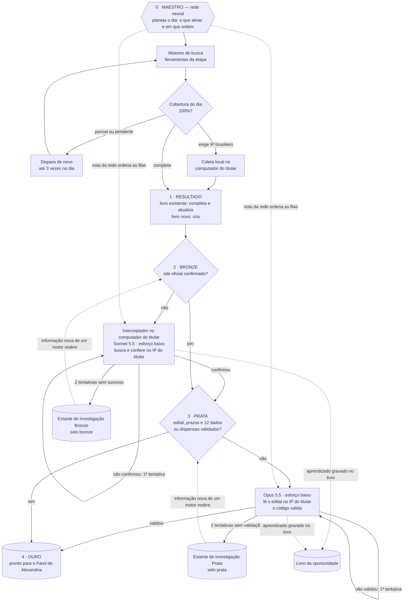

# Esteira metódica de selos — fluxograma (02/10/2026)

A rede neural (maestro) conduz cada etapa; os motores são ferramentas da etapa de busca.

| Selo | Significa | Estante quando não avança |
|---|---|---|
| Bronze | oportunidade identificada; site oficial não confirmado | Estante de Investigação Bronze (após 2 tentativas) |
| Prata | site oficial confirmado; edital, prazos ou 12 dados não validados | Estante de Investigação Prata (após 2 tentativas) |
| Ouro | edital, condições e prazos completos | pronto para o Farol de Alexandria |

Site oficial confirmado = o Interceptador confirmou no IP do titular, ou o endereço é de domínio público (.gov.br, .leg.br, .jus.br, .mp.br, PNCP) e não é republicador.
