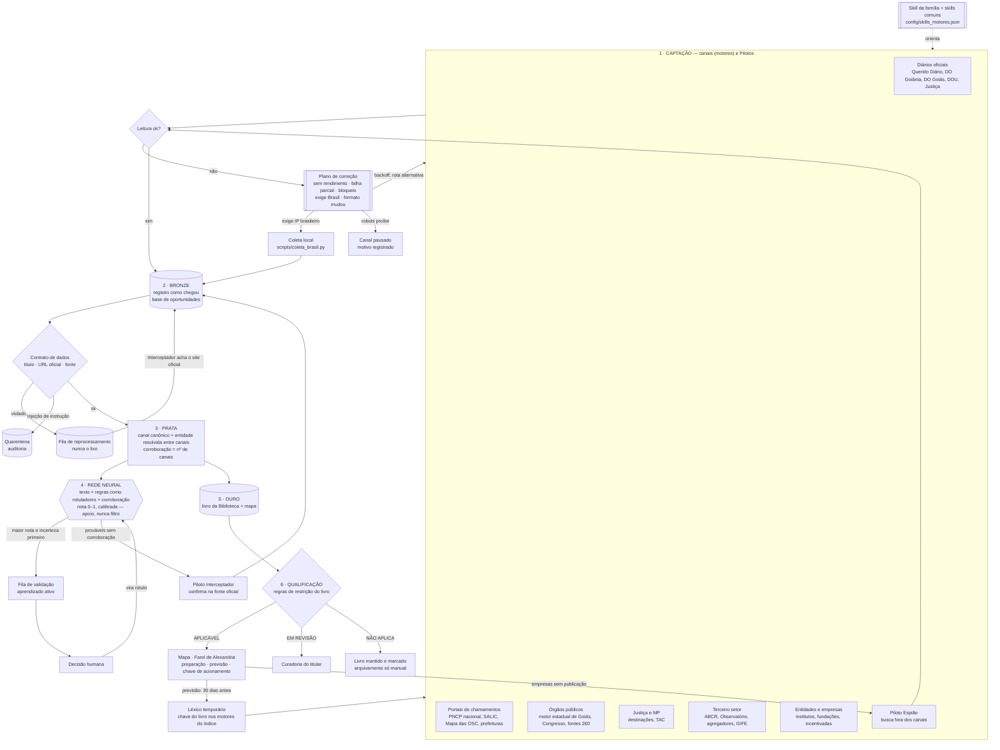

# Linha de produção de informação do Eldorado — fluxograma (02/10/2026)

Princípio: **cada canal só coleta; as etapas seguintes são comuns; nada é eliminado** (identificar → qualificar).
Toda mudança de etapa vai ao livro-razão (`estado/linha/razao-AAAA-MM.jsonl.gz`, só acréscimos).

## Planos de correção (previstos, aplicados a cada ciclo — `docs/dados/planos_correcao.json`)

| Diagnóstico | Quando | Plano |
|---|---|---|
| sem rendimento | 5+ leituras sem achado (só motores de descoberta) | robots.txt → página em JavaScript (procurar API/JSON) → rotas alternativas → reduzir frequência e mandar o domínio ao Espião |
| falha parcial | falhas em 3+ dos últimos 7 dias | backoff, reordenar rotas, registrar rota morta |
| bloqueio | 403/429/WAF | espaçar (Crawl-Delay), mudar horário; 403 persistente = exige IP brasileiro |
| exige Brasil | o site recusa o IP da nuvem | coleta local; as outras fontes do motor continuam; não conta como falha |
| formato mudou | zero itens hoje depois de dias com itens | comparar o HTML, alerta, atualizar o leitor e a lição da skill |
| contrato violado | sem título, sem URL oficial, URL de buscador | fila de reprocessamento → Interceptador → volta à linha |
| injeção | instrução ao modelo no texto coletado | quarentena (não vira livro nem prompt) |
