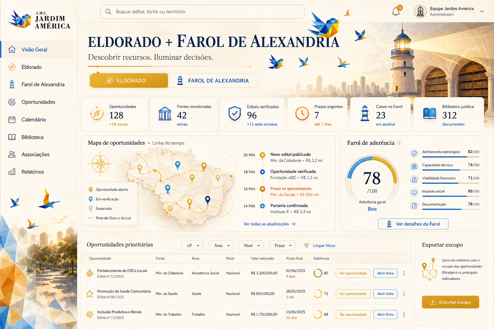
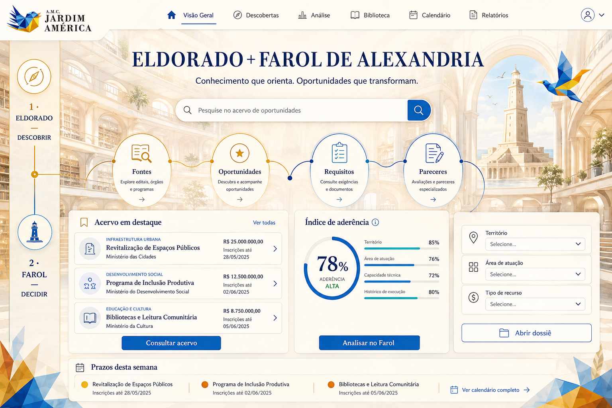
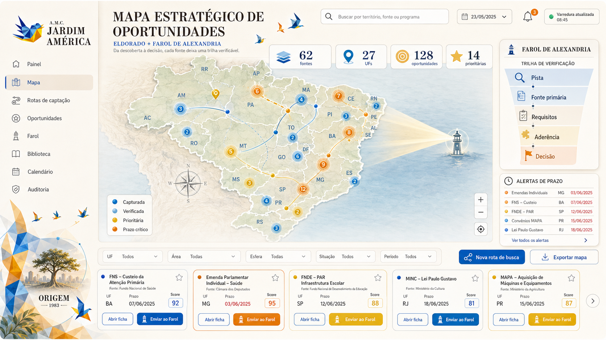
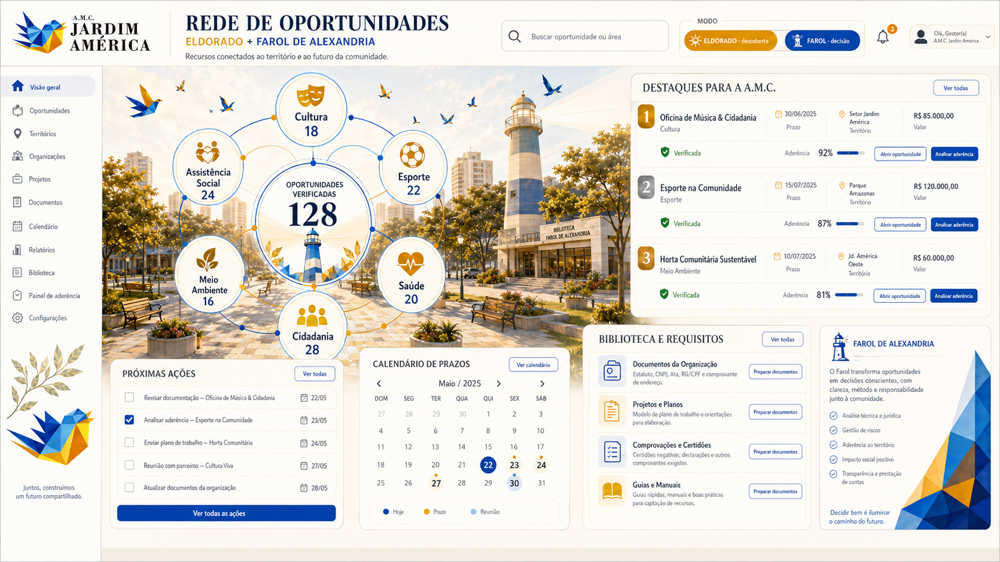
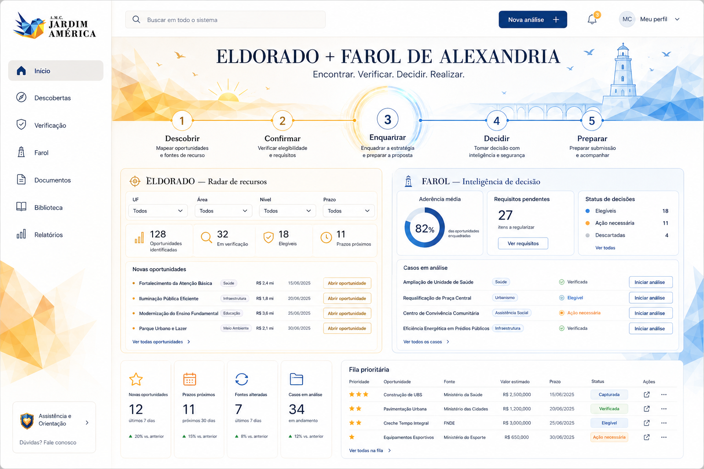

# Cinco identidades visuais — Eldorado + Farol de Alexandria

Data da proposta: 31/08/2026  
Titular: A.M.C. Jardim América

> Estas propostas não alteram a identidade ativa nem substituem o dashboard em produção. A opção escolhida deverá alimentar `config/identidade_visual.json` e então ser aplicada aos geradores HTML.

## 1. Contexto histórico e tradução para o sistema

### Alexandria: orientação e conhecimento

Alexandria foi fundada por Alexandre, o Grande, em 332 a.C. e desenvolvida pelos Ptolomeus como centro comercial e intelectual do Mediterrâneo. O Farol de Alexandria, na ilha de Pharos, tornou-se uma das Sete Maravilhas da Antiguidade e servia como referência para a navegação. A Biblioteca e o Mouseion reuniam e organizavam conhecimento de várias áreas.

No sistema, essa história é traduzida sem clichês egípcios:

- **Farol** = confirmar a fonte, iluminar riscos e orientar a decisão;
- **Biblioteca** = preservar leis, requisitos, evidências, modelos e pareceres;
- **porto e rotas** = conduzir cada oportunidade por uma trilha verificável;
- **arquitetura em três níveis** = pista → verificação → decisão.

Fonte de referência: [UNESCO — Alexandria, ancient remains and the new library](https://whc.unesco.org/en/tentativelists/1822/).

### Eldorado: descoberta responsável

Eldorado não foi uma cidade histórica comprovada. A lenda nasceu de relatos associados a cerimônias Muisca na atual Colômbia, nas quais um governante coberto de pó de ouro e oferendas lançadas no lago Guatavita alimentaram, entre europeus, a ideia posterior de uma cidade de riqueza ilimitada.

No sistema, a metáfora é usada de modo responsável:

- **ouro** = oportunidade valiosa, não promessa de dinheiro fácil;
- **mapa** = cobertura territorial e fontes monitoradas;
- **rota** = cadeia de evidências e auditoria;
- **descoberta** = pista que ainda precisa ser confirmada antes do Farol.

Não se usam conquistadores, baús, mapas piratas, apropriação de objetos sagrados ou estética de cassino.

Fonte de referência: [National Geographic — The real history behind El Dorado](https://www.nationalgeographic.com/history/article/el-dorado).

## 2. Princípios comuns às cinco opções

- Somente fundos claros: creme, marfim, bege e azul muito suave.
- Logomarca oficial da A.M.C. sem redesenho.
- Azul para confiança, validação, legislação e decisão.
- Dourado para descoberta, oportunidade e prioridade.
- Laranja apenas para alerta e prazo.
- Títulos editoriais serifados; interface em fonte sem serifa altamente legível.
- Pássaros e polígonos low poly como assinatura, nunca como ruído.
- Acessibilidade: contraste, foco visível, áreas clicáveis amplas e estados que não dependem apenas de cor.
- Componentes possíveis em HTML/CSS, sem depender de uma imagem de fundo para funcionar.

## 3. As cinco opções

### Opção 1 — Rota do Ouro e da Luz

Equilibra as duas narrativas. O mapa e as rotas representam a descoberta; o farol e a biblioteca representam a verificação. É a proposta mais completa para o painel geral.

**Melhor para:** visão executiva, métricas, mapa, ranking e tabela de oportunidades.  
**Custo de implementação:** médio.

### Opção 2 — Átrio do Conhecimento

Organiza a experiência como uma biblioteca cívica contemporânea. Os quatro módulos conectados — Fontes, Oportunidades, Requisitos e Pareceres — tornam a lógica do sistema autoexplicativa.

**Melhor para:** Biblioteca, legislação, requisitos, pareceres e dossiês.  
**Custo de implementação:** médio.

### Opção 3 — Cartografia do Tesouro Cívico

Coloca o Brasil e as 27 UFs no centro da operação. Fontes, rotas, clusters, prazos e o funil de verificação ficam legíveis em uma única tela.

**Melhor para:** operação diária, cobertura nacional, fontes e calendário.  
**Custo de implementação:** alto se o mapa for interativo; médio com SVG estático.

### Opção 4 — Praça das Conexões

É a proposta mais próxima das artes institucionais da A.M.C. A praça, os círculos e as linhas deixam de ser apenas ornamentais e viram filtros por área de atuação.

**Melhor para:** painel da associação, projetos, áreas de atuação e apresentação pública.  
**Custo de implementação:** médio-alto.

### Opção 5 — Portal Solar

É a alternativa mais limpa e escalável. A jornada Descobrir → Confirmar → Enquadrar → Decidir → Preparar separa visualmente o Eldorado dourado do Farol azul e pode ser repetida em todas as páginas.

**Melhor para:** sistema completo, páginas de edital e relatórios responsivos.  
**Custo de implementação:** baixo-médio.

## 4. Comparação objetiva

| Opção | AMC | Alexandria | Eldorado | Operação | Escalabilidade | Recomendação |
|---|---:|---:|---:|---:|---:|---|
| 1. Rota do Ouro e da Luz | alta | alta | alta | alta | alta | melhor equilíbrio geral |
| 2. Átrio do Conhecimento | média | muito alta | média | média | alta | melhor para biblioteca e Farol |
| 3. Cartografia | média | alta | muito alta | muito alta | média | melhor para monitoramento nacional |
| 4. Praça das Conexões | muito alta | média | média | alta | média | mais fiel às artes da associação |
| 5. Portal Solar | alta | alta | alta | muito alta | muito alta | recomendada para implementação integral |

**Recomendação técnica:** adotar a estrutura da Opção 5 como sistema-base e incorporar no dashboard inicial o mapa da Opção 3 e os módulos circulares da Opção 4. Isso preserva a identidade da A.M.C. sem comprometer manutenção, responsividade ou legibilidade.

## 5. Onde aplicar no repositório

| Arquivo/componente atual | Aplicação da identidade |
|---|---|
| `config/identidade_visual.json` | registrar tokens da opção aprovada e mudar o status para `ATIVO` |
| `src/painel.py` | cabeçalho, navegação, cards, filtros, botões, tabela, tags e rodapé |
| `docs/index.html` | saída gerada; não deve ser editada como fonte principal |
| `docs/dashboard.html` | calendário, bússola, editais, emendas e áreas do Farol |
| `src/fichas.py` | ficha completa de cada edital e trilha de evidências |
| `src/relatorio_amplitude.py` | métricas de cobertura, fontes e auditoria |
| `src/relatorio_busca.py` | resultados, lacunas e histórico de pesquisa |
| `docs/modelos/*.html` | componentes reutilizáveis e consistência entre páginas |

### Componentes que devem virar padrão

- **Botão primário dourado:** descoberta, busca, exportação e nova rota.
- **Botão primário azul:** confirmar, analisar, abrir ficha e preparar submissão.
- **Botão secundário:** fundo branco, contorno azul, foco visível.
- **Campo de busca:** superfície branca, borda bege/azul suave, ícone e rótulo persistente.
- **Select e filtros:** mesmos estados de foco, erro, desabilitado e seleção.
- **Cards:** superfície clara, borda fina, sombra editorial discreta e faixa de status.
- **Tags:** `capturada`, `verificada`, `elegível`, `ação necessária`, `prazo crítico` com texto e ícone, não apenas cor.
- **Caixas de texto longas:** para notas e pareceres, com contador, estado de salvamento e histórico.
- **Tabelas:** cabeçalho fixo, ordenação, filtros e ação principal sempre visível.

## 6. Próxima etapa após aprovação

1. escolher uma opção-base ou uma combinação explícita;
2. extrair tokens finais de cor, tipografia, raio, sombra e espaçamento;
3. atualizar `config/identidade_visual.json`;
4. criar componentes CSS reutilizáveis;
5. alterar primeiro `src/painel.py`, nunca apenas o HTML gerado;
6. regenerar painel, fichas e relatórios;
7. executar testes e validar desktop, tablet, celular, teclado e contraste.
